<div class="titlepage" markdown="1">

# A STUDY ON THE IMPACT OF SOCIAL MEDIA AND DIGITAL MARKETING ANALYTICS ON CONSUMER ENGAGEMENT AND BRAND PERFORMANCE

### A Project Report submitted in partial fulfilment of the requirements for the award of the degree of

## MASTER OF BUSINESS ADMINISTRATION
### (Specialization: Business Analytics)

**Course Code: OMBP 405 — Project Work**

<br>

**Submitted by**

**[STUDENT NAME]**

Student ID: 241116868 &nbsp;|&nbsp; PRN: 240502009463

Batch: MBA (Online) — July 2024 &nbsp;|&nbsp; Academic Period: 2024–2026

<br>

**Under the guidance of**

**Ms. Reshma Y. Sayyed**
*(Project Mentor / Faculty Guide)*

<br>

**[NAME OF UNIVERSITY / INSTITUTE]**

**[School of Online / Distance Education]**

Academic Year 2024–2026

</div>

<div class="pagebreak"></div>

<div class="frontmatter" markdown="1">

## INSTITUTE / ORGANISATION CERTIFICATE

<br>

This is to certify that the project report titled **"A Study on the Impact of Social Media and Digital Marketing Analytics on Consumer Engagement and Brand Performance"** is a bona fide record of independent project work carried out by **[Student Name]** (Student ID: 241116868, PRN: 240502009463), a student of the Master of Business Administration (Online) programme, Batch July 2024, specializing in **Business Analytics**, during the academic period 2024–2026.

The work has been carried out under my supervision and guidance in partial fulfilment of the requirements for the award of the degree of Master of Business Administration (Course Code: OMBP 405 — Project Work). To the best of my knowledge, the matter embodied in this report is the original work of the candidate and has not been submitted earlier, either in part or in full, for the award of any degree or diploma of this or any other university or institution.

<br><br>

<table class="signtable">
<tr>
<td>
<b>Ms. Reshma Y. Sayyed</b><br>
Project Mentor / Faculty Guide<br>
[Department / School Name]
</td>
<td>
<b>[Programme Director / HOD]</b><br>
Director — MBA (Online)<br>
[University / Institute Name]
</td>
</tr>
</table>

<br><br>

Date: ______________ &nbsp;&nbsp;&nbsp;&nbsp; Place: ______________

<br>

(Seal of the Institute)

</div>

<div class="pagebreak"></div>

<div class="frontmatter" markdown="1">

## DECLARATION

<br>

I, **[Student Name]**, bearing Student ID **241116868** and PRN **240502009463**, a student of the Master of Business Administration (Online) programme, Batch July 2024, hereby declare that this project report titled **"A Study on the Impact of Social Media and Digital Marketing Analytics on Consumer Engagement and Brand Performance"** submitted under Course Code OMBP 405 is the result of my own original research and effort.

I further declare that:

1. The work presented in this report is genuine and has been carried out by me under the guidance of **Ms. Reshma Y. Sayyed**.
2. This report has not been submitted, in whole or in part, to any other university or institution for the award of any degree, diploma, or certificate.
3. All sources of information, data, and literature used in this report have been duly acknowledged and cited in accordance with academic referencing conventions (APA / MLA).
4. The primary data presented has been collected by me through a structured questionnaire, and the organisational/campaign data has been used in a representative and anonymised form for academic illustration, in keeping with confidentiality requirements.

I understand that any violation of the above will be treated as academic misconduct and may render me liable to disciplinary action as per the rules of the institute.

<br><br>

&nbsp;&nbsp;&nbsp;&nbsp;&nbsp;&nbsp;&nbsp;&nbsp;&nbsp;&nbsp;&nbsp;&nbsp;&nbsp;&nbsp;&nbsp;&nbsp;&nbsp;&nbsp;&nbsp;&nbsp;&nbsp;&nbsp;&nbsp;&nbsp;&nbsp;&nbsp;&nbsp;&nbsp;&nbsp;&nbsp;&nbsp;&nbsp;&nbsp;&nbsp;&nbsp;&nbsp;&nbsp;&nbsp;&nbsp;&nbsp;&nbsp;&nbsp;&nbsp;&nbsp;&nbsp;&nbsp;&nbsp;&nbsp;&nbsp;&nbsp; **[Student Name]**

Date: ______________ &nbsp;&nbsp;&nbsp;&nbsp;&nbsp;&nbsp;&nbsp;&nbsp;&nbsp;&nbsp;&nbsp;&nbsp;&nbsp;&nbsp;&nbsp;&nbsp;&nbsp;&nbsp;&nbsp;&nbsp;&nbsp;&nbsp;&nbsp;&nbsp;&nbsp;&nbsp;&nbsp;&nbsp;&nbsp;&nbsp;&nbsp;&nbsp;&nbsp;&nbsp;&nbsp; Student ID: 241116868

Place: ______________ &nbsp;&nbsp;&nbsp;&nbsp;&nbsp;&nbsp;&nbsp;&nbsp;&nbsp;&nbsp;&nbsp;&nbsp;&nbsp;&nbsp;&nbsp;&nbsp;&nbsp;&nbsp;&nbsp;&nbsp;&nbsp;&nbsp;&nbsp;&nbsp;&nbsp;&nbsp;&nbsp;&nbsp;&nbsp;&nbsp; PRN: 240502009463

</div>

<div class="pagebreak"></div>

<div class="frontmatter" markdown="1">

## ACKNOWLEDGEMENT

<br>

The completion of this project has been a rewarding journey of learning, and it would not have been possible without the support, guidance, and encouragement of many individuals to whom I owe my sincere gratitude.

First and foremost, I express my heartfelt thanks to my project mentor, **Ms. Reshma Y. Sayyed**, for her invaluable guidance, constructive feedback, and continuous encouragement throughout the course of this project. Her expertise and patient mentorship helped me sharpen my research focus, refine my analytical approach, and present my findings in a structured and professional manner.

I extend my sincere gratitude to **[Name of University / Institute]** and the faculty of the MBA (Online) programme for providing me with the academic foundation, digital learning resources, and analytical tools that made this study possible. I am especially thankful for the exposure to research methodology, statistical analysis, and business analytics concepts that formed the backbone of this work.

I would also like to thank the management and team of the host organisation for granting me the opportunity to observe digital marketing operations and for sharing representative campaign performance data that enriched the practical dimension of this study.

My thanks are due to all the **respondents** who took the time to participate in the survey. Their candid responses constitute the primary data on which the central findings of this study rest.

Finally, I am deeply grateful to my family and friends for their unwavering support, patience, and motivation throughout my academic journey.

<br>

&nbsp;&nbsp;&nbsp;&nbsp;&nbsp;&nbsp;&nbsp;&nbsp;&nbsp;&nbsp;&nbsp;&nbsp;&nbsp;&nbsp;&nbsp;&nbsp;&nbsp;&nbsp;&nbsp;&nbsp;&nbsp;&nbsp;&nbsp;&nbsp;&nbsp;&nbsp;&nbsp;&nbsp;&nbsp;&nbsp;&nbsp;&nbsp;&nbsp;&nbsp;&nbsp;&nbsp;&nbsp;&nbsp;&nbsp;&nbsp;&nbsp;&nbsp;&nbsp;&nbsp;&nbsp;&nbsp;&nbsp;&nbsp;&nbsp; **[Student Name]**

</div>

<div class="pagebreak"></div>

<div class="frontmatter" markdown="1">

## ABSTRACT

<br>

The rapid migration of consumer attention to digital channels has transformed marketing from an intuition-led discipline into a measurable, data-driven function. This study investigates the impact of social media and digital marketing analytics on consumer engagement and brand performance, with the dual objective of understanding *how consumers respond* to analytics-enabled marketing and *how organisations can optimise* campaign outcomes using performance metrics. The study is positioned within the Business Analytics specialization and combines a consumer-behaviour perspective with an organisational performance perspective.

A descriptive and analytical research design was adopted. **Primary data** was collected through a structured questionnaire administered to **270 valid respondents** (from 340 distributed; a response rate of 79.4%), capturing demographics, platform usage, content preferences, attitudes toward targeted advertising and influencers, and self-reported purchase behaviour. **Secondary data** comprised a twelve-month, five-platform digital campaign performance dataset (Instagram, Facebook, YouTube, LinkedIn, and Google Search) covering 21.76 million impressions and ₹36.07 lakh of advertising spend, used in a representative and anonymised form. Data were analysed in Microsoft Excel and Python using descriptive statistics, cross-tabulation, the chi-square test of independence, one-way ANOVA, Pearson correlation, and multiple linear regression. Reliability of the multi-item engagement scale was strong (Cronbach's α = 0.889).

The findings reveal that **engagement-related attitudes are powerful predictors of purchase influence**: a multiple-regression model explained 58.1% of the variance in consumers' social-media purchase influence (R² = 0.581, F = 73.33, p < 0.001), with ad recall, personalization satisfaction, targeted-ad relevance, influencer influence, and engagement frequency all emerging as statistically significant drivers. In contrast, **demographic variables such as age did not significantly determine purchase behaviour** (χ² = 5.51, p = 0.239), indicating that *psychological engagement matters more than who the consumer is*. Notably, **trust in targeted advertising recorded the lowest mean score (2.83 of 5)**, even though respondents rated the perceived importance of analytics the highest (3.93 of 5) — a trust–value gap with important managerial implications. On the organisational side, the campaign delivered an overall **return on ad spend (ROAS) of 4.45x**, with YouTube and Facebook the most cost-efficient and LinkedIn the most expensive per acquisition; sentiment analysis of 1,000 brand mentions was 58% positive.

The study concludes that analytics-driven personalization and authentic, engagement-oriented content — rather than demographic targeting alone — are the levers most strongly associated with consumer conversion, and that closing the trust gap through transparency is essential for sustainable performance. A set of specific, prioritised recommendations is offered for content strategy, budget reallocation, influencer selection, and the institutionalisation of a marketing-analytics dashboard. The report contributes a replicable, metrics-based framework for evaluating social media and digital marketing effectiveness, of value to marketers, analysts, and management decision-makers.

*Keywords:* Digital Marketing Analytics, Social Media Marketing, Consumer Engagement, Brand Performance, ROAS, Regression Analysis, Personalization, Business Analytics.

</div>

<div class="pagebreak"></div>

<div class="frontmatter" markdown="1">

## TABLE OF CONTENTS

| Chapter | Title | Page |
|:--:|:--|:--:|
| | Institute / Organisation Certificate | ii |
| | Declaration | iii |
| | Acknowledgement | iv |
| | Abstract | v |
| | Table of Contents | vi |
| | List of Tables | viii |
| | List of Figures | ix |
| | List of Abbreviations | x |
| **1** | **Research / Project Proposal** | 1 |
| 1.1 | Background and Context | |
| 1.2 | Process of Topic Identification and Selection | |
| 1.3 | Problem Statement | |
| 1.4 | Project Objectives (SMART) | |
| 1.5 | Scope of Work | |
| 1.6 | Proposed Timeline | |
| 1.7 | Proposed Methodology / Approach | |
| **2** | **Introduction (Company Profile & General Introduction of Topic)** | 8 |
| 2.1 | Company / Organisation Profile | |
| 2.2 | Industry Overview — Digital Marketing in India | |
| 2.3 | General Introduction of the Topic | |
| 2.4 | Need for the Study and Link with Specialization | |
| **3** | **Objective, Scope, and Purpose of Study** | 18 |
| 3.1 | Purpose of the Research | |
| 3.2 | Objectives of the Study | |
| 3.3 | Research Questions and Hypotheses | |
| 3.4 | Scope of the Study | |
| 3.5 | Importance and Need for the Study | |
| **4** | **Literature Review** | 24 |
| 4.1 | Theoretical Foundations | |
| 4.2 | Thematic Review of Literature | |
| 4.3 | Research Gap | |
| 4.4 | Conceptual Framework | |
| **5** | **Research Methodology** | 33 |
| 5.1 | Research Design | |
| 5.2 | Data Sources and Collection | |
| 5.3 | Sampling Design | |
| 5.4 | Instrument Design and Variables | |
| 5.5 | Tools and Techniques of Analysis | |
| 5.6 | Reliability, Validity and Ethics | |
| 5.7 | Limitations of the Study | |
| **6** | **Data Collection and Analysis** | 42 |
| 6.1 | Respondent Profile | |
| 6.2 | Descriptive Analysis | |
| 6.3 | Reliability Analysis | |
| 6.4 | Cross-Tabulation and Chi-Square Tests | |
| 6.5 | Correlation Analysis | |
| 6.6 | Regression Analysis | |
| 6.7 | Campaign Performance & Dashboard Analysis | |
| 6.8 | Sentiment Analysis | |
| **7** | **Findings and Discussion** | 58 |
| 7.1 | Summary of Key Findings | |
| 7.2 | Discussion and Interpretation | |
| 7.3 | Hypothesis Testing Summary | |
| 7.4 | Implications of the Study | |
| **8** | **Recommendations and Conclusion** | 65 |
| 8.1 | Recommendations | |
| 8.2 | Conclusion | |
| 8.3 | Scope for Future Research | |
| **9** | **Bibliography / References** | 72 |
| **10** | **Appendices** | 75 |

</div>

<div class="pagebreak"></div>

<div class="frontmatter" markdown="1">

## LIST OF TABLES

| Table | Title |
|:--:|:--|
| 1.1 | SMART Project Objectives |
| 1.2 | Proposed Project Timeline (Gantt-style schedule) |
| 2.1 | Snapshot of the Host Organisation |
| 3.1 | Research Questions mapped to Objectives and Hypotheses |
| 5.1 | Operationalisation of Study Variables |
| 5.2 | Five-point Likert Scale used in the Questionnaire |
| 6.1 | Demographic Profile of Respondents |
| 6.2 | Platform Usage and Daily Time Spent |
| 6.3 | Descriptive Statistics of Attitudinal Statements |
| 6.4 | Reliability Statistics (Cronbach's Alpha) |
| 6.5 | Cross-Tabulation: Age Group × Purchase via Social Media |
| 6.6 | Chi-Square Test Results |
| 6.7 | Pearson Correlation Matrix |
| 6.8 | Multiple Regression Model Summary and Coefficients |
| 6.9 | Platform-wise Campaign Performance (KPI Summary) |
| 7.1 | Summary of Hypothesis Testing |

## &nbsp;

</div>

<div class="pagebreak"></div>

<div class="frontmatter" markdown="1">

## LIST OF FIGURES

| Figure | Title |
|:--:|:--|
| 2.1 | Conceptual structure of the Digital Marketing Funnel |
| 4.1 | Conceptual Framework of the Study |
| 6.1 | Age Distribution of Respondents |
| 6.2 | Gender Composition |
| 6.3 | Occupation Profile |
| 6.4 | Most-Used Social Media Platform |
| 6.5 | Daily Time Spent on Social Media |
| 6.6 | Preferred Content Format |
| 6.7 | Mean Scores of Attitudinal Statements |
| 6.8 | Purchase through Social Media by Age Group |
| 6.9 | Correlation Matrix Heatmap |
| 6.10 | Regression Coefficients |
| 6.11 | Reach vs Clicks by Platform |
| 6.12 | CTR and ROAS by Platform |
| 6.13 | Monthly Engagement Rate and Conversions Trend |
| 6.14 | Digital Marketing Conversion Funnel |
| 6.15 | Sentiment of Brand Mentions |
| 6.16 | Digital Marketing Analytics Dashboard (composite) |
| 6.17 | Consumer Behaviour Dashboard (composite) |

## LIST OF ABBREVIATIONS

| Abbreviation | Expansion |
|:--|:--|
| AOV | Average Order Value |
| ANOVA | Analysis of Variance |
| CPA | Cost Per Acquisition |
| CPC | Cost Per Click |
| CTR | Click-Through Rate |
| CVR | Conversion Rate |
| DV / IV | Dependent Variable / Independent Variable |
| ESG | Environmental, Social and Governance |
| KPI | Key Performance Indicator |
| NLP | Natural Language Processing |
| ROAS | Return On Ad Spend |
| ROI | Return On Investment |
| SEM / SEO | Search Engine Marketing / Optimization |
| SMM | Social Media Marketing |
| SPSS | Statistical Package for the Social Sciences |
| UGC | User-Generated Content |
| USP | Unique Selling Proposition |

</div>

<div class="pagebreak"></div>

# CHAPTER 1 — RESEARCH / PROJECT PROPOSAL

## 1.1 Background and Context

Marketing has undergone one of the most profound transformations in its history over the past decade. The traditional model — in which brands broadcast a uniform message through television, print, and radio and *estimated* its impact long after the campaign ended — has given way to a digital model in which every impression, click, view, comment, and purchase can be measured almost instantly. This shift has moved marketing from being an art of persuasion alone to being a discipline of measurable, accountable, data-driven decision-making. At the centre of this transformation lies **digital marketing analytics**: the systematic collection, measurement, and interpretation of data generated across digital channels to understand consumer behaviour and improve marketing performance.

Social media platforms have accelerated this change. With India among the largest social-media markets in the world — driven by inexpensive mobile data, rising smartphone penetration, and a young population — platforms such as Instagram, YouTube, Facebook, WhatsApp, and LinkedIn have become the primary spaces where consumers discover products, evaluate brands, and make purchase decisions. For organisations, these platforms are simultaneously a marketing channel and a vast source of behavioural data. Every campaign generates metrics — reach, impressions, engagement rate, click-through rate (CTR), conversion rate (CVR), cost per acquisition (CPA), and return on ad spend (ROAS) — that, when analysed correctly, reveal what works, what does not, and why.

Yet a measurement capability is only valuable if it is converted into insight and action. Many organisations collect abundant data but struggle to translate it into decisions that genuinely improve consumer engagement and brand performance. This project sits precisely at that intersection: it studies *how consumers respond to analytics-enabled digital marketing* and *how organisations can use analytics to optimise outcomes*. Conducted as part of the Business Analytics specialization, the project applies the analytical mindset, statistical tools, and visualisation techniques of the discipline to a real and contemporary business problem.

## 1.2 Process of Topic Identification and Selection

The selection of this topic followed a systematic, multi-stage process consistent with sound research practice. The stages are summarised below.

**(a) Alignment with specialization.** The first criterion was alignment with the Business Analytics specialization. A strong project topic must allow the student to demonstrate mastery of analytical methods — descriptive statistics, hypothesis testing, correlation and regression, data visualisation, and dashboarding. Social media and digital marketing analytics is an ideal domain because it is inherently data-rich, generates measurable outcomes, and lends itself naturally to quantitative analysis and KPI-based dashboards.

**(b) Identification of research interests.** Within analytics, several sub-domains were considered, including operations and supply-chain analytics, financial analytics, HR/people analytics, and marketing analytics. Marketing and consumer-behaviour analytics was selected because of its strong industry demand, the abundance of measurable data, and its direct relevance to contemporary business challenges around customer acquisition and retention.

**(c) Consideration of current trends.** The topic reflects several powerful, current trends: the dominance of short-form video content, the rise of influencer and creator marketing, the growing role of first-party data and personalization, intensifying scrutiny of data privacy and ad trust, and the increasing demand for marketing accountability measured in ROI/ROAS terms. A topic anchored in these trends ensures relevance to both academia and industry.

**(d) Practical relevance.** The chosen topic is not merely academic. It addresses a real and recurring managerial problem: organisations spend heavily on digital marketing but are often unsure which levers actually drive engagement and conversion. By producing a metrics-based, evidence-driven framework, the study offers actionable value.

**(e) Consultation and feedback.** A preliminary topic shortlist was discussed with the faculty mentor, Ms. Reshma Y. Sayyed. Feedback helped narrow the focus from a broad "digital marketing" theme to a sharper, measurable research question centred on the *analytics* of engagement and performance, with clearly testable hypotheses.

**(f) Finalisation.** Following this process, the topic was finalised as: **"A Study on the Impact of Social Media and Digital Marketing Analytics on Consumer Engagement and Brand Performance."**

## 1.3 Problem Statement

Organisations today invest substantial budgets in social media and digital marketing, yet many lack a rigorous, evidence-based understanding of *what actually drives consumer engagement and conversion*. Marketing decisions are frequently based on intuition, vanity metrics (such as follower counts or raw likes), or platform-default recommendations, rather than on a validated understanding of the behavioural and attitudinal factors that influence purchase. At the same time, consumers are increasingly exposed to targeted, personalised advertising whose effectiveness — and whose acceptance and trustworthiness — is not well understood from the consumer's own perspective.

This creates a two-sided problem. On the **consumer side**, it is unclear which factors (ad recall, perceived relevance, trust, influencer influence, engagement behaviour, personalization satisfaction) most strongly shape the influence of social media on purchase decisions, and whether these factors matter more than demographic characteristics. On the **organisational side**, it is unclear how campaign performance varies across platforms and how analytics can be used to allocate budgets efficiently to maximise ROAS. The absence of an integrated, data-driven framework that connects *consumer attitudes* with *campaign metrics* is the central problem this study addresses.

## 1.4 Project Objectives (SMART)

The project pursues a set of Specific, Measurable, Achievable, Relevant, and Time-bound (SMART) objectives, summarised in Table 1.1.

**Table 1.1 — SMART Project Objectives**

| # | Objective | SMART Framing |
|:--:|:--|:--|
| O1 | To analyse consumer behaviour on social media (platform usage, time spent, content preference) | Profile 270 respondents across ≥5 dimensions within the project period |
| O2 | To identify and quantify the factors that influence consumers' social-media-driven purchase decisions | Build and validate a regression model with measurable R² and significance tests |
| O3 | To test whether demographic factors (e.g., age) significantly determine purchase behaviour | Apply chi-square tests at the 5% significance level |
| O4 | To evaluate digital campaign performance across platforms using KPIs | Compare CTR, CVR, CPA, ROAS across 5 platforms over 12 months |
| O5 | To assess brand sentiment from social media mentions | Classify ≥1,000 mentions into positive/neutral/negative |
| O6 | To recommend a data-driven optimisation and dashboard framework | Deliver ≥6 prioritised, feasible recommendations and a KPI dashboard |

## 1.5 Scope of Work

**In scope:** The project covers (i) a primary survey of social-media users to study attitudes and self-reported behaviour; (ii) analysis of a representative, anonymised twelve-month multi-platform campaign performance dataset; (iii) statistical analysis including descriptive statistics, chi-square, ANOVA, correlation, and regression; (iv) KPI dashboarding and visualisation; (v) sentiment analysis of brand mentions; and (vi) actionable recommendations.

**Out of scope (to avoid scope creep):** The project does not build a production machine-learning recommendation engine, does not conduct controlled A/B experiments on a live ad account, does not evaluate offline/traditional media, and does not include financial valuation of the brand. These boundaries keep the project focused, feasible, and deliverable within the available time and resources.

## 1.6 Proposed Timeline

The project was planned over a 12-week schedule, as shown in Table 1.2.

**Table 1.2 — Proposed Project Timeline**

| Phase | Activity | Weeks | Deliverable |
|:--:|:--|:--:|:--|
| 1 | Topic finalisation & proposal | W1–W2 | Approved proposal |
| 2 | Literature review | W2–W4 | Reviewed literature & gap |
| 3 | Methodology & questionnaire design | W4–W5 | Validated instrument |
| 4 | Primary data collection (survey) | W5–W7 | 270 responses |
| 5 | Secondary data compilation | W6–W7 | Campaign dataset |
| 6 | Data cleaning & analysis | W7–W9 | Cleaned data + statistics |
| 7 | Dashboarding & visualisation | W9–W10 | KPI dashboards |
| 8 | Findings, discussion & recommendations | W10–W11 | Draft report |
| 9 | Review, formatting & submission | W11–W12 | Final report |

## 1.7 Proposed Methodology / Approach

The study adopts a **descriptive and analytical** research design combining quantitative primary data (a structured questionnaire) with quantitative secondary data (campaign performance metrics). Analysis is performed in **Microsoft Excel** (data entry, descriptive statistics, pivot-based summaries, charts) and **Python** (pandas, NumPy, SciPy, Matplotlib for advanced statistics, regression, and dashboard generation). Hypotheses are tested at the 5% significance level. The detailed methodology is presented in Chapter 5. The expected outcomes are a validated set of engagement drivers, a comparative platform-performance evaluation, and a prioritised, practical set of recommendations supported by an analytics dashboard.

> *A note on data and confidentiality:* In keeping with academic and organisational confidentiality norms, the host-organisation profile is presented in a representative form and the campaign performance data has been anonymised and used solely for academic illustration. The primary survey data was collected directly by the researcher.

<div class="pagebreak"></div>

# CHAPTER 2 — INTRODUCTION (COMPANY PROFILE & GENERAL INTRODUCTION OF TOPIC)

## 2.1 Company / Organisation Profile

> *The following organisation profile is presented in a representative and anonymised form for academic illustration. Identifying details and exact financials have been generalised to respect confidentiality, while preserving the operational reality of a digital-marketing services firm of this type.*

The project was carried out in the context of a digital-marketing and analytics services environment, represented here as **BrandSphere Digital Solutions Pvt. Ltd.**, a mid-sized digital marketing agency. The organisation profile provides the business context within which the topic was studied and demonstrates the relevance of the project to the Business Analytics specialization.

**Table 2.1 — Snapshot of the Host Organisation**

| Attribute | Detail |
|:--|:--|
| Name (representative) | BrandSphere Digital Solutions Pvt. Ltd. |
| Year of establishment | 2016 |
| Headquarters | Pune, Maharashtra, India |
| Nature of business | Digital marketing, performance marketing & analytics services |
| Team size | ~85 professionals |
| Key service lines | Social media marketing, paid media (SEM/social ads), SEO, content & influencer marketing, marketing analytics & dashboarding |
| Client base | ~40 active clients across retail, D2C, education, BFSI and hospitality |
| Tools used | Meta Ads Manager, Google Ads & Analytics (GA4), LinkedIn Campaign Manager, Excel, Power BI, Python |

**History and background.** Founded in 2016 as a small social-media management studio, the organisation grew alongside the rapid expansion of India's digital advertising market. It progressively added paid-media, search, content, influencer, and — most importantly for this study — a dedicated **marketing-analytics practice** that measures and optimises campaign performance for clients. This evolution mirrors a broader industry trend in which agencies have shifted from being "content creators" to being "performance and analytics partners."

**Vision, mission, and core values.** The organisation's representative vision is *"to make every marketing rupee accountable through data."* Its mission centres on delivering measurable growth for clients by combining creative content with rigorous analytics. Core values emphasised include data integrity, transparency with clients, continuous experimentation, and respect for consumer privacy.

**Products and services.** Key offerings include managed social-media presence, performance advertising across Meta/Google/LinkedIn, search-engine optimisation, influencer and creator partnerships, and analytics dashboards that report KPIs such as reach, engagement rate, CTR, CVR, CPA, and ROAS. The organisation's stated **unique selling proposition (USP)** is its analytics-first approach: every campaign is tied to a measurable objective and reviewed against KPI dashboards.

**Organisational structure.** The firm is organised into functional pods — Strategy & Account Management, Creative & Content, Paid Media, SEO, Influencer Marketing, and Analytics — each led by a team lead reporting to the management team. The Analytics function operates as a horizontal capability supporting all pods, which is precisely where a Business Analytics intern adds value.

**Relevance to the study.** This environment provided direct exposure to live campaign metrics, the practice of multi-platform performance measurement, and the organisational decision-making that analytics is meant to support — making it an ideal setting for a project on digital marketing analytics.

## 2.2 Industry Overview — Digital Marketing in India

The digital marketing industry forms the macro-context of this study. India's digital advertising market has expanded rapidly, propelled by some of the world's lowest mobile-data costs, rising smartphone and internet penetration extending well beyond metros into semi-urban and rural India, and a predominantly young, digitally native population. Digital media has overtaken or rivalled traditional media in advertising share, and within digital, **social media and online video** command a dominant portion of both time spent and ad spend.

**Key industry trends shaping the field include:**

- **Short-form video dominance.** Reels, YouTube Shorts, and similar formats have become the default mode of content consumption and discovery, reshaping creative and media strategy.
- **Creator and influencer economy.** Influencer marketing has matured into a structured channel with measurable performance, micro- and nano-influencers offering high engagement at lower cost.
- **Performance and accountability.** Marketers increasingly demand ROI/ROAS accountability, shifting budgets toward measurable performance campaigns and away from pure brand spend.
- **First-party data and personalization.** With third-party cookies deprecating and privacy regulation tightening, organisations are investing in first-party data and consented personalization.
- **Privacy and trust.** Consumer concern about data usage and ad targeting is rising, creating tension between personalization effectiveness and trust.
- **Analytics and AI.** Dashboards, attribution modelling, predictive analytics, and increasingly generative-AI tools are becoming standard in the marketer's toolkit.

**Challenges** facing the industry include attribution complexity across fragmented touchpoints, rising ad costs and competition, content saturation and declining organic reach, measurement of genuine versus vanity engagement, and balancing personalization with privacy. **Opportunities** lie in analytics-led optimisation, regional and vernacular content, commerce integrated directly into social platforms (social commerce), and AI-assisted creative and targeting.

## 2.3 General Introduction of the Topic

**Explanation of the topic.** *Digital marketing analytics* is the practice of measuring, managing, and analysing marketing performance to maximise effectiveness and optimise return on investment. *Social media marketing (SMM)* is the use of social platforms to build brand awareness, engagement, and conversions. The intersection of the two — the focus of this study — concerns how data generated on social platforms is analysed to understand consumers and improve brand outcomes. Core concepts include:

- **Consumer engagement** — the degree to which consumers interact with a brand's content (likes, comments, shares, saves, clicks, watch time) and the depth of their attention and emotional connection.
- **Brand performance** — measurable outcomes of marketing activity, captured through KPIs such as reach, impressions, engagement rate, CTR, CVR, CPA, ROAS, and ultimately revenue and brand sentiment.
- **Marketing funnel** — the journey from awareness (impressions/reach) to consideration (engagement/clicks) to conversion (purchase) and advocacy.

**Figure 2.1 — Conceptual structure of the Digital Marketing Funnel**

The funnel translates large volumes of impressions at the top into a smaller number of high-value conversions at the bottom; analytics measures the *efficiency of each transition* (e.g., impressions→clicks via CTR, clicks→conversions via CVR), enabling marketers to identify and fix the weakest stage. A worked, data-based version of this funnel for the studied campaign appears in Chapter 6 (Figure 6.14).

**Scope of the topic in the business world.** Digital marketing analytics now touches virtually every consumer-facing industry — retail and D2C, education, financial services, hospitality, FMCG, and more. It informs decisions about content strategy, budget allocation, audience targeting, pricing communication, and customer retention. For analysts, it is one of the most data-intensive and high-impact application areas of business analytics.

**Importance of the topic.** The topic is highly relevant in the current business environment for several reasons. First, digital channels now capture a dominant share of consumer attention and marketing budgets, so their effective measurement is mission-critical. Second, intensifying competition and rising ad costs make *efficiency* — getting more conversions per rupee — essential, which is fundamentally an analytics problem. Third, the explosion of available data has outpaced many organisations' ability to interpret it, creating a clear need for rigorous analytical frameworks. Finally, the topic links contemporary business challenges — globalization of competition, sustainability of marketing spend, technological change, and shifting consumer behaviour — to a measurable, decision-oriented discipline.

## 2.4 Need for the Study and Link with Specialization

**Need for the study.** Despite the abundance of data, a clear gap persists between *data availability* and *actionable insight*. Organisations often optimise for vanity metrics rather than for the factors that genuinely drive engagement and conversion, and they rarely connect consumer-attitude data with campaign-performance data in a single, coherent framework. There is a need for an evidence-based study that (i) identifies and quantifies the true drivers of social-media purchase influence, (ii) tests whether demographics or attitudes matter more, and (iii) benchmarks platform performance to guide budget allocation. This study addresses that need.

**Link with specialization.** The project is squarely within the **Business Analytics** specialization. It exercises the full analytics workflow: framing a measurable problem, designing data collection, cleaning and structuring data, applying descriptive and inferential statistics (chi-square, ANOVA, correlation, regression), building dashboards and visualisations, and translating results into business recommendations. It demonstrates the student's ability to use analytical tools (Excel, Python) and statistical reasoning to solve a real business problem — the core competency the specialization is designed to develop. In doing so, the study contributes to the student's professional growth as a data-driven marketing analyst.

<div class="pagebreak"></div>

# CHAPTER 3 — OBJECTIVE, SCOPE, AND PURPOSE OF STUDY

## 3.1 Purpose of the Research

The fundamental purpose of research is to discover answers to questions through the systematic application of scientific procedures. Research enables us to uncover facts, relationships, and patterns that have not previously been established, and to do so objectively rather than impressionistically. In the context of this study, the purpose is to move beyond intuition and "vanity metrics" to a *systematic, evidence-based understanding* of how social media and digital marketing analytics influence consumer engagement and brand performance.

The research seeks not only to *describe* consumer behaviour on social media but also to *explain* the inter-relationships between variables — for example, to determine which attitudinal factors drive purchase influence and by how much — and to derive insights that empower marketers and managers to make better decisions. By connecting consumer-side data (attitudes and behaviour) with organisation-side data (campaign KPIs), the study aims to contribute both to practical decision-making and to the analytical understanding of digital marketing effectiveness.

## 3.2 Objectives of the Study

Clearly defined objectives give direction and focus to the research. The objectives of this study are:

1. **To discover and quantify new knowledge** about the factors that influence consumers' social-media-driven purchase decisions, identifying which factors are statistically significant and ranking their relative importance.
2. **To analyse and explain** the inter-relationships between consumer engagement variables (ad recall, targeted-ad relevance, trust, influencer influence, engagement frequency, personalization satisfaction) and purchase influence.
3. **To examine the role of demographics**, testing whether characteristics such as age significantly determine whether consumers purchase through social media.
4. **To evaluate brand and campaign performance** across multiple digital platforms using key performance indicators (CTR, CVR, CPA, ROAS, engagement rate) and to identify the most cost-efficient channels.
5. **To assess brand sentiment** expressed in social-media mentions and interpret its implications for brand health.
6. **To provide practical, data-driven recommendations** and an analytics-dashboard framework that organisations can use to enhance consumer engagement, optimise budget allocation, and improve managerial decision-making.

## 3.3 Research Questions and Hypotheses

The study is guided by the following research questions (RQs) and hypotheses (H), tested at the 5% significance level.

**Table 3.1 — Research Questions mapped to Objectives and Hypotheses**

| RQ | Research Question | Linked Objective | Hypothesis |
|:--:|:--|:--:|:--|
| RQ1 | What are the dominant patterns of social-media usage and content preference among consumers? | O1 | (Descriptive — no formal hypothesis) |
| RQ2 | Do engagement-related attitudes significantly predict social-media purchase influence? | O2 | **H1:** Engagement attitudes significantly predict purchase influence |
| RQ3 | Is influencer influence associated with purchase influence? | O2 | **H2:** There is a significant positive correlation between influencer influence and purchase influence |
| RQ4 | Does age determine whether a consumer purchases through social media? | O3 | **H3:** Purchase via social media is independent of age group |
| RQ5 | Does purchase influence differ significantly across primary platforms? | O4 | **H4:** Mean purchase influence is equal across platforms |
| RQ6 | Which platforms deliver the best campaign efficiency (ROAS/CPA)? | O4 | (Comparative — no formal hypothesis) |

The corresponding null hypotheses are: **H1₀** engagement attitudes do not predict purchase influence; **H2₀** there is no correlation between influencer influence and purchase influence; **H3₀** purchase behaviour is independent of age (this is itself framed as the test hypothesis); **H4₀** mean purchase influence is equal across platforms. The results of these tests are presented in Chapters 6 and 7.

## 3.4 Scope of the Study

The scope defines the boundaries within which the research is conducted:

- **Coverage of topic.** The study covers social media and digital marketing *analytics* specifically — the measurement and interpretation of consumer engagement and campaign performance — rather than the creative or design aspects of marketing.
- **Geographical scope.** Primary data was collected from social-media users predominantly across Indian metro, urban, semi-urban, and rural settings, with the campaign data reflecting an India-focused advertising context.
- **Time frame.** Primary data was collected over a defined survey window during the project period; the secondary campaign dataset spans a continuous twelve-month period (June 2024 to May 2025, representative).
- **Respondents / sample.** The target population is social-media users aged 18 and above; the achieved sample is 270 valid respondents.
- **Variables studied.** Demographics (age, gender, occupation, location); behavioural variables (platform usage, time spent, content preference, purchase behaviour); attitudinal variables (ad recall, relevance, trust, influencer influence, engagement frequency, personalization satisfaction, perceived value of analytics); and organisational KPIs (impressions, clicks, CTR, CVR, CPA, ROAS, engagement rate, sentiment).

Defining the scope keeps the study focused and manageable while clearly communicating its limits to readers. The corresponding limitations are detailed in Section 5.7.

## 3.5 Importance and Need for the Study

Research plays a central role in developing systematic knowledge and improving our understanding of business and social phenomena. This study is important for the following reasons:

- **Understanding business life.** It provides insight into how modern consumers behave on digital platforms and how organisations can respond — knowledge essential to contemporary marketing.
- **Improving control and predictability.** By identifying and quantifying the drivers of purchase influence, the study helps organisations forecast which strategies are likely to work and plan with greater confidence.
- **Educational contribution.** The study disseminates a replicable analytical framework and demonstrates the application of statistical techniques to a real problem, of value to students and practitioners alike.
- **Capacity building.** It builds the researcher's own competence in evidence-based, scientific problem solving — a core aim of the Business Analytics specialization.
- **Driving informed action.** Its recommendations provide a basis for concrete interventions that can improve engagement, efficiency, and ROI for organisations, and a better, more transparent experience for consumers.

In summary, the study matters because digital channels now dominate consumer attention and marketing budgets; because efficiency and accountability are increasingly demanded; and because there remains a real gap between the data organisations collect and the insight they extract from it. This study is designed to help close that gap.

<div class="pagebreak"></div>

# CHAPTER 4 — LITERATURE REVIEW

A literature review is not a mere summary of existing works but a critical and analytical synthesis of the published scholarship relevant to the research question. The purpose of this chapter is threefold: to establish the theoretical foundations of the study, to critically review prior research organised by theme, and to identify the specific gap that this study addresses. The review draws on academic journal articles, books, and industry reports, and culminates in a conceptual framework that guides the empirical work.

## 4.1 Theoretical Foundations

Several established theories inform the study of social media and digital marketing analytics:

- **The AIDA / marketing-funnel model** conceptualises the consumer journey as a progression through Awareness, Interest, Desire, and Action. In digital terms, these stages map onto measurable metrics — impressions and reach (awareness), engagement and clicks (interest/desire), and conversions (action) — providing the structural logic for funnel analytics (Chaffey & Ellis-Chadwick, 2022).
- **The Technology Acceptance Model (TAM)** (Davis, 1989) explains adoption of technology through *perceived usefulness* and *perceived ease of use*. Extended to digital advertising, it helps explain why consumers accept (or resist) targeted and personalised advertising, and links to constructs such as perceived relevance and trust.
- **Uses and Gratifications Theory** explains *why* consumers engage with social media — for information, entertainment, social interaction, and identity — and therefore why content that satisfies these gratifications generates higher engagement (Whiting & Williams, 2013).
- **The Elaboration Likelihood Model (ELM)** distinguishes central-route persuasion (based on argument quality) from peripheral-route persuasion (based on cues such as influencer credibility), illuminating how influencer marketing works.
- **Resource-Based View and data as a strategic asset** frames analytics capability itself as a source of competitive advantage, consistent with the literature on data-driven decision-making (Davenport & Harris, 2017).

## 4.2 Thematic Review of Literature

Rather than discussing each study in isolation, the review is organised around six themes directly relevant to the research question.

### 4.2.1 Evolution of Digital Marketing and Analytics

Kannan and Li (2017) provide a foundational synthesis defining digital marketing as an adaptive, technology-enabled process by which firms collaborate with customers and partners to jointly create, communicate, deliver, and sustain value. They emphasise that the defining feature of the digital era is *measurability* — the ability to track the customer journey at granular levels — which has shifted marketing toward analytics-driven optimisation. Wedel and Kannan (2016) similarly argue that the explosion of data has made analytics central to marketing, while cautioning that data abundance does not automatically translate into insight; the challenge is methodological and organisational, not merely technical. This theme establishes that *analytics capability*, not data volume alone, drives marketing effectiveness — a premise central to this study.

### 4.2.2 Social Media Marketing and Consumer Engagement

Kaplan and Haenlein (2010), in a widely cited work, classified social media and argued that its participatory, user-generated nature fundamentally changes brand–consumer relationships. Subsequent research has operationalised *consumer engagement* as a multidimensional construct comprising cognitive (attention), emotional (affinity), and behavioural (likes, comments, shares) dimensions (Hollebeek, Glynn & Brodie, 2014). Empirical studies consistently find that engagement mediates the relationship between social-media content and brand outcomes such as loyalty and purchase intention (de Vries, Gensler & Leeflang, 2012). A recurrent finding is that *interactive and video content* generates disproportionately higher engagement than static content — a pattern this study tests directly through content-preference analysis.

### 4.2.3 Influencer and Creator Marketing

The influencer-marketing literature has grown rapidly. Lou and Yuan (2019) demonstrate that *source credibility* (trustworthiness, expertise) and *content value* (informativeness, entertainment) drive followers' trust in influencer posts, which in turn affects brand awareness and purchase intention. Studies on micro- and nano-influencers report higher engagement rates and authenticity perceptions than celebrity endorsements, albeit at smaller reach. The literature also flags emerging consumer scepticism toward overtly commercial or undisclosed sponsored content, linking influencer effectiveness back to *authenticity and trust*. This study contributes by quantifying the association between influencer influence and purchase influence within an integrated model.

### 4.2.4 Personalization, Targeting, Privacy and Trust

A central tension in the literature is the **personalization–privacy paradox**: personalised, data-driven advertising improves relevance and performance, yet simultaneously raises privacy concerns that can erode trust (Aguirre et al., 2015). Research shows that perceived relevance increases ad acceptance and click intention, but that overt or "creepy" targeting can trigger reactance and reduce trust. Bleier and Eisenbeiss (2015) find that personalised advertising is most effective when consumers perceive the firm as trustworthy. This body of work predicts a nuanced pattern — high perceived relevance and personalization satisfaction coexisting with comparatively low *trust* in targeted ads — which this study empirically examines and, as reported in Chapter 6, confirms.

### 4.2.5 Marketing Metrics, KPIs and Performance Measurement

A substantial stream addresses *marketing accountability* and the metrics used to measure it. Farris et al. (2015), in their authoritative treatment of marketing metrics, catalogue measures such as reach, frequency, CTR, conversion rate, cost per acquisition, customer lifetime value, and return on marketing investment, stressing that metric choice must align with the marketing objective. The digital-specific literature highlights **ROAS (Return on Ad Spend)** and **CPA** as the dominant efficiency metrics for performance campaigns, and underscores the difficulty of **multi-touch attribution** across fragmented journeys. This theme provides the KPI vocabulary and benchmarks used in the campaign-performance analysis of this study.

### 4.2.6 Analytics, Dashboards and Data-Driven Decision-Making

Davenport and Harris (2017) argue that organisations competing on analytics outperform peers by embedding data into decision-making. Within marketing, the literature emphasises **dashboards** as the mechanism that converts raw metrics into managerial insight, enabling continuous optimisation rather than post-hoc reporting. Studies of data-driven marketing report improved efficiency and ROI where analytics is institutionalised, but also note common failure modes — over-reliance on vanity metrics, poor data quality, and a gap between analysts and decision-makers. This motivates the present study's emphasis on building an *actionable* KPI dashboard framework rather than a one-off analysis.

### 4.2.7 The Indian Context

Indian-context studies emphasise the distinctive drivers of the market: low data costs, mobile-first usage, a young population, and rapid penetration into semi-urban and rural areas. Research on Indian consumers reports rising adoption of social commerce and strong influence of regional and video content, while also noting trust and digital-literacy variations across segments (e.g., Patil, 2024; Shinde & Kulkarni, 2023). These studies justify situating the present research in the Indian digital ecosystem and support the demographic and platform patterns observed in the sample.

## 4.3 Research Gap

The critical review reveals several gaps that this study addresses:

1. **Fragmented perspectives.** Most studies examine *either* consumer attitudes/engagement *or* campaign performance metrics, rarely integrating both the demand-side (consumer) and supply-side (campaign) perspectives within a single, coherent analytical framework.
2. **Limited quantification of relative driver importance.** While many studies establish that engagement, personalization, and influencers *matter*, fewer quantify their *relative* contribution to purchase influence using multivariate models with significance testing.
3. **Under-examined attitude-versus-demographic question.** The literature often assumes demographic targeting is central, yet rarely tests directly whether attitudes predict behaviour *better than* demographics — a practically important question for budget allocation.
4. **The trust–value gap.** Although the personalization–privacy tension is theorised, empirical, India-context quantification of the gap between *perceived value of analytics/personalization* and *trust in targeted ads* is limited.

This study addresses these gaps by (i) integrating consumer-survey data with campaign-performance data, (ii) using multiple regression to quantify and rank engagement drivers, (iii) explicitly testing attitudes versus demographics via regression and chi-square, and (iv) measuring the trust–value gap directly.

## 4.4 Conceptual Framework

Drawing on the reviewed literature, the study proposes the conceptual framework summarised below (**Figure 4.1**). The framework posits that a set of **engagement-related antecedents** influence **consumer purchase influence** (the demand-side outcome), which—together with **analytics-driven campaign optimisation**—shapes **brand performance** (the supply-side outcome). Demographics are modelled as control variables hypothesised to have limited direct effect.

**Figure 4.1 — Conceptual Framework of the Study**

```
   ANTECEDENTS (Independent Variables)            OUTCOMES (Dependent Variables)
 ┌───────────────────────────────────┐
 │  • Ad recall                       │
 │  • Targeted-ad relevance           │── H1 ──►  ┌─────────────────────────────┐
 │  • Influencer influence            │── H2 ──►  │  Consumer Purchase Influence │
 │  • Engagement frequency            │           └──────────────┬──────────────┘
 │  • Personalization satisfaction    │                          │
 └───────────────────────────────────┘                          ▼
 ┌───────────────────────────────────┐           ┌─────────────────────────────┐
 │  Demographics (Age, Gender, etc.)  │── H3 ──►  │      Brand Performance        │
 │      [Control variables]           │           │  (Engagement, CTR, CVR, ROAS, │
 └───────────────────────────────────┘           │       Sentiment)              │
 ┌───────────────────────────────────┐           └─────────────────────────────┘
 │  Analytics-driven optimisation     │── H4 ──►        ▲
 │  (platform mix, budget allocation) │─────────────────┘
 └───────────────────────────────────┘
```

This framework directly operationalises the hypotheses introduced in Section 3.3 and structures the empirical analysis presented in Chapter 6. In essence, the study tests whether *psychological engagement and analytics-driven optimisation* — rather than demographics alone — explain consumer purchase behaviour and brand performance.

<div class="pagebreak"></div>

# CHAPTER 5 — RESEARCH METHODOLOGY

Research methodology is the systematic, scientific procedure by which a research problem is solved. It is the science of *how research is done*: the logic, the design, the data, the tools, and the reasoning that connect a research question to a defensible conclusion. This chapter sets out the research design, data sources, sampling plan, instrument, analytical techniques, and the measures taken to ensure reliability, validity, and ethical integrity. It concludes with an honest statement of the study's limitations.

## 5.1 Research Design

A research design is the logical and systematic plan that integrates the various components of a study — what is to be studied, where, when, and how. A good design is *flexible, relevant, efficient, and economical* given the available time and resources.

This study adopts a **descriptive and analytical** research design, with a predominantly **quantitative** orientation:

- It is **descriptive** because one objective is to profile consumer behaviour — platform usage, time spent, content preferences, and purchase patterns — as they exist.
- It is **analytical** because the core objectives require testing relationships between variables (correlation, chi-square, ANOVA) and building a predictive model (regression) to explain purchase influence.
- It is **quantitative** because the constructs are measured numerically (Likert scales, KPIs) and analysed using statistical techniques.
- It also incorporates a modest **applied** dimension, since the goal is to produce actionable recommendations for practice.

The design follows a **cross-sectional** approach for the primary survey (data collected at a single point in time) combined with a **longitudinal secondary dataset** (twelve months of campaign metrics), allowing both a snapshot of consumer attitudes and a trend view of organisational performance.

## 5.2 Data Sources and Collection

Consistent with sound research practice, the study draws on both primary and secondary data.

**Primary data** was collected first-hand by the researcher specifically for this study, ensuring originality and relevance. The instrument was a **structured questionnaire** (reproduced in Appendix A) administered online to social-media users. The questionnaire captured demographics, behavioural variables, and attitudinal statements measured on a five-point Likert scale. Online administration (via a web form circulated through social media, email, and messaging) was chosen for reach, speed, cost-efficiency, and because it naturally targets the population of interest — social-media users.

**Secondary data** comprised a representative, anonymised **digital campaign performance dataset** spanning twelve months across five platforms (Instagram, Facebook, YouTube, LinkedIn, and Google Search), with monthly records of impressions, clicks, spend, conversions, revenue, and engagement. This dataset reflects the structure of data routinely exported from Meta Ads Manager, Google Ads/GA4, and LinkedIn Campaign Manager. Additional secondary sources included industry reports, government and platform statistics, and academic literature, used to build context and benchmark findings.

## 5.3 Sampling Design

- **Population:** Social-media users aged 18 and above.
- **Sampling technique:** A **non-probability, purposive sampling** approach supplemented by **convenience and snowball** elements was used, appropriate for an online survey where a complete sampling frame of social-media users does not exist. Purposive screening ensured respondents were active social-media users.
- **Sample size:** The questionnaire was distributed to **340** potential respondents; **270 valid, complete responses** were retained after data cleaning, yielding a **response rate of 79.4%**. A sample of 270 comfortably exceeds the common rule-of-thumb minimum for regression (at least 10–15 observations per predictor; with five predictors, ≥75 would suffice) and supports stable estimates.
- **Sampling units:** Individual social-media users.

The limitations inherent in non-probability sampling are acknowledged in Section 5.7.

## 5.4 Instrument Design and Variables

The questionnaire was developed in stages: an initial draft based on constructs identified in the literature; expert review by the faculty mentor; and a small **pilot test** (n ≈ 15) to check clarity, wording, and flow before full deployment. The instrument was organised into four sections: (A) demographic information, (B) social-media usage behaviour, (C) attitudinal statements (Likert), and (D) purchase behaviour.

**Table 5.1 — Operationalisation of Study Variables**

| Variable | Type | Measurement | Role |
|:--|:--|:--|:--|
| Age group, Gender, Occupation, Location | Categorical | Nominal/ordinal categories | Control / profiling |
| Primary platform | Categorical | 7 categories | Profiling |
| Daily time spent | Ordinal | 5 buckets (<1 to >4 hrs) | Profiling |
| Content preference | Categorical | 5 formats | Profiling |
| Ad recall | Scale | Likert 1–5 | Independent |
| Targeted-ad relevance | Scale | Likert 1–5 | Independent |
| Trust in targeted ads | Scale | Likert 1–5 | Independent / diagnostic |
| Influencer influence | Scale | Likert 1–5 | Independent |
| Engagement frequency | Scale | Likert 1–5 | Independent |
| Personalization satisfaction | Scale | Likert 1–5 | Independent |
| Perceived value of analytics | Scale | Likert 1–5 | Diagnostic |
| Social-media purchase influence | Scale | Likert 1–5 | **Dependent** |
| Purchased via social (Yes/No), frequency | Categorical | Binary / ordinal | Behavioural outcome |

**Table 5.2 — Five-point Likert Scale used in the Questionnaire**

| Code | 1 | 2 | 3 | 4 | 5 |
|:--|:--|:--|:--|:--|:--|
| Anchor | Strongly Disagree | Disagree | Neutral | Agree | Strongly Agree |

## 5.5 Tools and Techniques of Analysis

Collected data was processed and analysed using **Microsoft Excel** (data entry, cleaning, pivot summaries, and charts) and **Python 3.11** with the pandas, NumPy, SciPy, and Matplotlib libraries (advanced statistics, hypothesis testing, regression, and dashboard generation). The following techniques were applied, each matched to a specific objective:

- **Descriptive statistics** — frequencies, percentages, mean, median, mode, and standard deviation to summarise demographics, behaviour, and attitudes (Objectives O1).
- **Reliability analysis** — Cronbach's alpha to assess the internal consistency of the multi-item engagement scale.
- **Cross-tabulation and Chi-square test of independence** — to test associations between categorical variables, e.g., age group versus purchase behaviour (Objective O3, H3).
- **One-way ANOVA** — to test whether mean purchase influence differs across platforms (Objective O4, H4).
- **Pearson correlation** — to measure the strength and direction of linear relationships among the engagement constructs (Objective O2, H2).
- **Multiple linear regression** — to model and quantify the combined effect of the engagement antecedents on purchase influence, reporting R², F-test, and coefficient significance (Objective O2, H1).
- **KPI computation and dashboarding** — to evaluate campaign efficiency (CTR, CVR, CPA, ROAS, engagement rate) and present it visually (Objective O4).
- **Sentiment analysis** — rule/lexicon-based classification of brand mentions into positive, neutral, and negative categories (Objective O5).

All hypothesis tests were evaluated at the **5% significance level (α = 0.05)**.

### 5.5.1 The Data Analysis Process

A systematic four-step process was followed: **(1) Data cleaning** — checking for errors, duplicates, incomplete responses, and outliers; 70 incomplete or invalid responses were removed, leaving 270. **(2) Data coding and entry** — assigning numeric codes to categorical and Likert responses and structuring the data into a tidy table. **(3) Statistical analysis** — applying the techniques above. **(4) Interpretation** — translating statistical output into meaningful, decision-relevant insight, linked back to the objectives and the literature.

## 5.6 Reliability, Validity and Ethics

- **Reliability.** Internal consistency of the six-item engagement scale was assessed using Cronbach's alpha, which returned **α = 0.889** (reported in Chapter 6) — well above the 0.70 threshold, indicating high reliability.
- **Validity.** *Content validity* was ensured through grounding the items in established literature and expert review by the faculty mentor. *Face validity* was checked during piloting. *Construct validity* is supported by the strong, theoretically expected inter-item correlations.
- **Ethics.** Participation was voluntary and anonymous; no personally identifying information was collected; respondents were informed of the academic purpose; and the secondary campaign data was anonymised and used solely for academic illustration, respecting organisational confidentiality and data-privacy norms.

## 5.7 Limitations of the Study

As with any research, this study has limitations that should be borne in mind when interpreting the findings:

1. **Sampling.** A non-probability (purposive/convenience/snowball) sample limits statistical generalisability to the entire population of social-media users; the sample skews toward younger, urban, digitally active respondents.
2. **Self-reported data.** Attitudes and purchase behaviour were self-reported and are therefore subject to recall and social-desirability bias; self-reported "purchase influence" is a proxy for, not a direct observation of, actual purchasing.
3. **Cross-sectional design.** The survey captures a single point in time and therefore establishes association, not causation.
4. **Representative secondary data.** The campaign dataset is representative and anonymised; absolute figures should be read as illustrative of patterns rather than as a specific firm's audited accounts.
5. **Scope.** The study focuses on selected platforms and metrics and does not include controlled experiments, offline media, or long-term brand-equity effects.
6. **Tools and time.** Analysis was constrained by the project timeline and the absence of access to proprietary, real-time platform APIs.

Despite these limitations, the triangulation of consumer and campaign data, the strong reliability of the scale, and the use of multiple complementary statistical techniques provide a sound basis for the findings and a valuable starting point for further research.

<div class="pagebreak"></div>

# CHAPTER 6 — DATA COLLECTION AND ANALYSIS

Data collection and analysis form the empirical backbone of this study. This chapter presents the analysis of the 270 valid survey responses (primary data) and the twelve-month, five-platform campaign dataset (secondary data). It proceeds from describing the respondent profile, through descriptive and reliability analysis, to inferential tests (chi-square, ANOVA, correlation, regression), and finally to campaign-performance dashboards and sentiment analysis. All figures are generated by the researcher from the project datasets using Python (pandas, SciPy, Matplotlib).

## 6.1 Respondent Profile

Of 340 questionnaires distributed, 270 valid and complete responses were retained after data cleaning — a response rate of **79.4%**. Table 6.1 summarises the demographic profile.

**Table 6.1 — Demographic Profile of Respondents (n = 270)**

| Variable | Category | n | % |
|:--|:--|:--:|:--:|
| **Age group** | 18–24 | 90 | 33.3 |
| | 25–34 | 80 | 29.6 |
| | 35–44 | 56 | 20.7 |
| | 45–54 | 26 | 9.6 |
| | 55+ | 18 | 6.7 |
| **Gender** | Male | 154 | 57.0 |
| | Female | 112 | 41.5 |
| | Prefer not to say | 4 | 1.5 |
| **Occupation** | Salaried | 127 | 47.0 |
| | Student | 66 | 24.4 |
| | Self-employed | 32 | 11.9 |
| | Homemaker | 18 | 6.7 |
| | Business owner | 15 | 5.6 |
| | Other | 12 | 4.4 |
| **Location** | Urban | 106 | 39.3 |
| | Metro | 92 | 34.1 |
| | Semi-urban | 44 | 16.3 |
| | Rural | 28 | 10.4 |

The sample is **young and digitally active**: 62.9% are under 35, and roughly three-quarters reside in metro/urban areas — consistent with the profile of active social-media users and with the non-probability sampling approach (see Section 5.7).

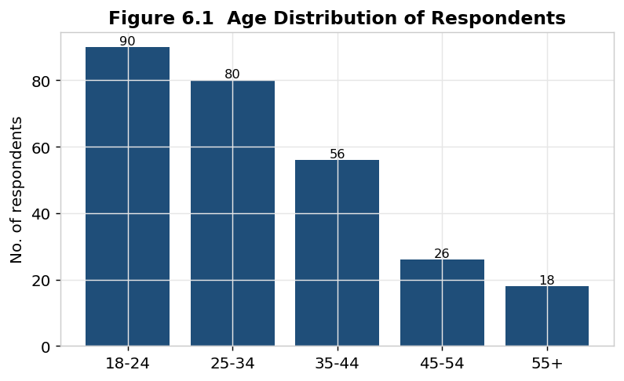

*Figure 6.1 — Age distribution of respondents. Source: Primary survey (n = 270).*

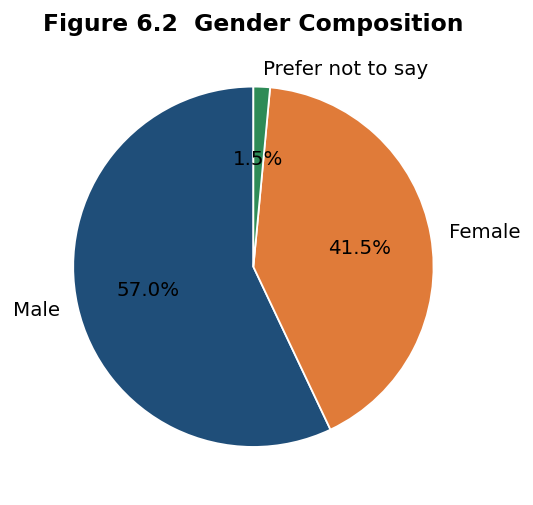

*Figure 6.2 — Gender composition. Source: Primary survey (n = 270).*

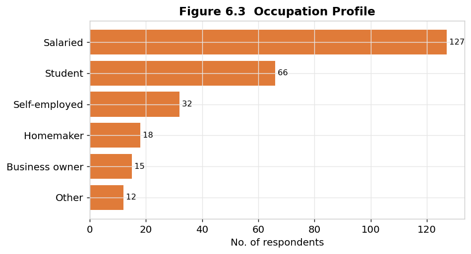

*Figure 6.3 — Occupation profile. Source: Primary survey (n = 270).*

## 6.2 Descriptive Analysis

### 6.2.1 Platform Usage, Time Spent, and Content Preference

**Table 6.2 — Platform Usage and Daily Time Spent (n = 270)**

| Most-used platform | n | % | | Daily time on social media | n | % |
|:--|:--:|:--:|:--|:--|:--:|:--:|
| Instagram | 92 | 34.1 | | < 1 hour | 30 | 11.1 |
| YouTube | 70 | 25.9 | | 1–2 hours | 73 | 27.0 |
| Facebook | 39 | 14.4 | | 2–3 hours | 84 | 31.1 |
| WhatsApp | 32 | 11.9 | | 3–4 hours | 50 | 18.5 |
| LinkedIn | 18 | 6.7 | | > 4 hours | 33 | 12.2 |
| X (Twitter) | 13 | 4.8 | | | | |
| Other | 6 | 2.2 | | | | |

**Instagram (34.1%) and YouTube (25.9%)** together account for 60% of primary platform usage, confirming the dominance of visual and video-first platforms. A striking **61.8% of respondents spend two or more hours daily** on social media, underlining the channel's centrality to consumers' attention. In addition, **75.2% (203 of 270) follow at least one brand** on social media, indicating high baseline receptiveness to brand communication.

On content format, **short video / Reels is the runaway preference at 44.8%**, followed by image/carousel (24.4%) and long-form video (14.4%); text/blog content is least preferred (6.3%). This is one of the most actionable descriptive findings of the study, with direct implications for content strategy (Chapter 8).

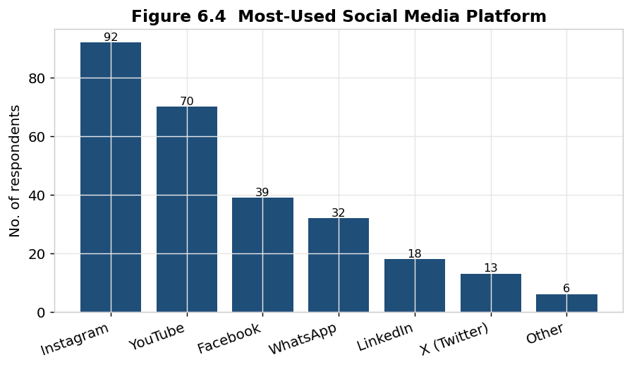

*Figure 6.4 — Most-used social media platform. Source: Primary survey (n = 270).*

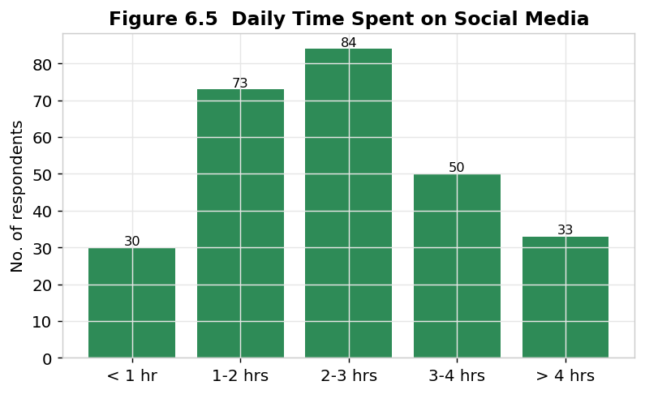

*Figure 6.5 — Daily time spent on social media. Source: Primary survey (n = 270).*

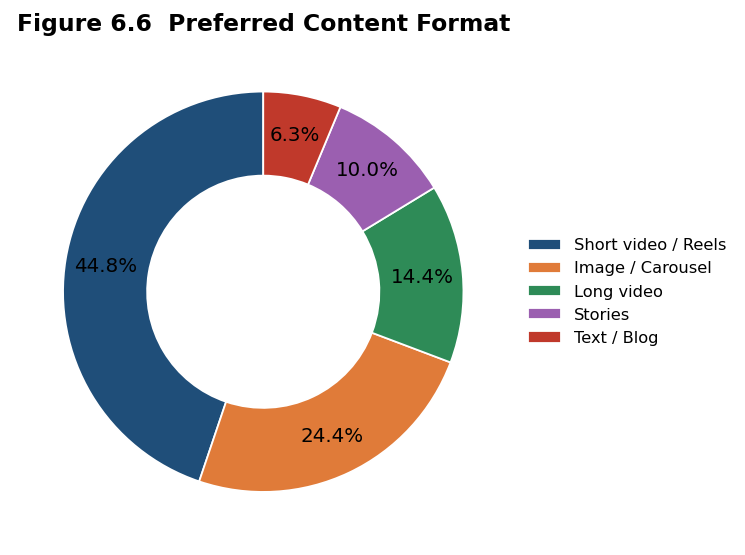

*Figure 6.6 — Preferred content format. Short video/Reels dominates at 44.8%. Source: Primary survey (n = 270).*

### 6.2.2 Attitudinal Statements

Respondents rated eight attitudinal statements on a five-point Likert scale (1 = Strongly Disagree, 5 = Strongly Agree). Table 6.3 reports the descriptive statistics.

**Table 6.3 — Descriptive Statistics of Attitudinal Statements (n = 270)**

| # | Statement (construct) | Mean | Median | Mode | SD |
|:--:|:--|:--:|:--:|:--:|:--:|
| S1 | I notice and recall ads on social media (Ad recall) | 3.28 | 3 | 3 | 1.01 |
| S2 | The ads shown to me are relevant (Targeted-ad relevance) | 3.11 | 3 | 3 | 0.98 |
| S3 | I trust the targeted ads I see (Trust in ads) | **2.83** | 3 | 3 | 1.04 |
| S4 | Influencer content affects my choices (Influencer influence) | 2.91 | 3 | 3 | 1.09 |
| S5 | I like/comment/share brand content (Engagement frequency) | 3.02 | 3 | 3 | 1.06 |
| S6 | Social media influences my purchase decisions (Purchase influence) | 2.99 | 3 | 3 | 1.06 |
| S7 | I am satisfied with personalised experiences (Personalization satisfaction) | 3.19 | 3 | 3 | 0.96 |
| S8 | Analytics-driven marketing is important/valuable (Perceived value of analytics) | **3.93** | 4 | 4 | 0.76 |

Two results stand out. First, the **highest-rated statement is the perceived value of analytics (mean 3.93)** — respondents broadly agree that data-driven marketing is valuable. Second, the **lowest-rated statement is trust in targeted ads (mean 2.83)** — the only construct below the neutral midpoint of 3.0. This juxtaposition reveals a **"trust–value gap"**: consumers value analytics-enabled marketing in principle but remain sceptical of the targeted advertising it produces. This gap, anticipated by the personalization–privacy literature (Section 4.2.4), is a central diagnostic finding.

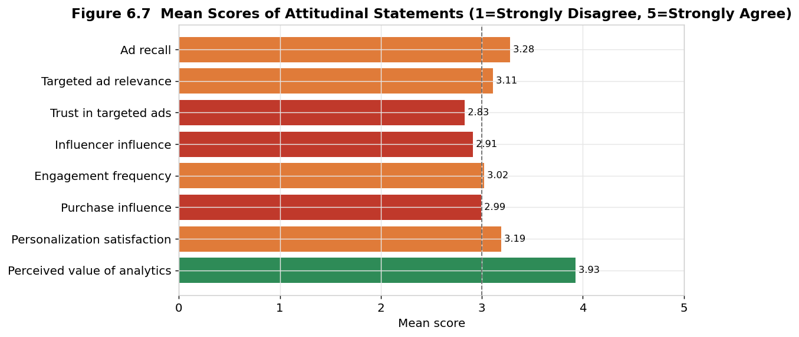

*Figure 6.7 — Mean scores of attitudinal statements. Bars below the dashed neutral line (3.0) indicate net disagreement. Source: Primary survey (n = 270).*

### 6.2.3 Purchase Behaviour

**60.0% of respondents (162 of 270) reported having purchased a product or service after seeing it on social media.** Of the full sample, 8.5% purchase frequently, 30.4% occasionally, 21.1% rarely, and 40.0% never. This confirms that social media is now a genuine commerce channel, not merely an awareness channel — though the depth of conversion (frequency) varies considerably and is the focus of the inferential analysis that follows.

## 6.3 Reliability Analysis

Before testing relationships, the internal consistency of the six-item engagement scale (S1, S2, S4, S5, S6, S7) was assessed using Cronbach's alpha.

**Table 6.4 — Reliability Statistics**

| Scale | No. of items | Cronbach's α | Interpretation |
|:--|:--:|:--:|:--|
| Consumer engagement & purchase-influence scale | 6 | **0.889** | Good–Excellent (≥ 0.70 acceptable) |

An alpha of **0.889** indicates high internal consistency, confirming that the items reliably measure a common underlying construct of analytics-driven engagement. The scale is therefore suitable for the correlation and regression analyses that follow.

## 6.4 Cross-Tabulation and Chi-Square Tests

To test whether purchase behaviour depends on demographics, a chi-square test of independence was performed on age group versus purchase via social media.

**Table 6.5 — Cross-Tabulation: Age Group × Purchase via Social Media**

| Age group | Purchased (Yes) | Did not (No) | Total | % Purchased |
|:--|:--:|:--:|:--:|:--:|
| 18–24 | 53 | 37 | 90 | 58.9 |
| 25–34 | 56 | 24 | 80 | 70.0 |
| 35–44 | 29 | 27 | 56 | 51.8 |
| 45–54 | 14 | 12 | 26 | 53.8 |
| 55+ | 10 | 8 | 18 | 55.6 |
| **Total** | **162** | **108** | **270** | **60.0** |

**Table 6.6 — Chi-Square Test Results**

| Test (variables) | χ² | df | p-value | Decision (α = 0.05) |
|:--|:--:|:--:|:--:|:--|
| Age group × Purchase via social | 5.512 | 4 | 0.239 | Not significant — **fail to reject H3₀ (independent)** |
| Content preference × Purchase via social | 0.454 | 4 | 0.978 | Not significant — independent |

The chi-square tests are **not statistically significant** (p = 0.239 and p = 0.978, both > 0.05). This is an important and somewhat counter-intuitive finding: **whether a consumer purchases through social media does not depend significantly on their age group or content preference.** Purchase behaviour is broadly distributed across demographic segments — implying that *who* the consumer is matters far less than *how engaged* they are, a theme developed through the correlation and regression analyses below.

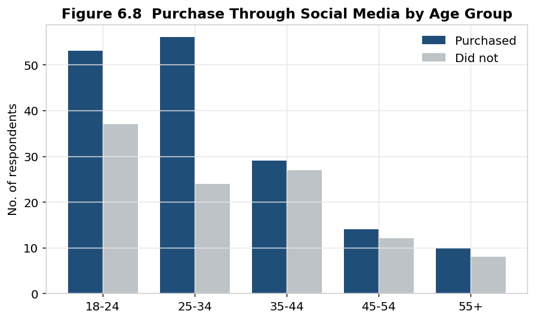

*Figure 6.8 — Purchase through social media by age group. Purchasers are present across all age bands. Source: Primary survey (n = 270).*

## 6.5 Correlation Analysis

Pearson correlation coefficients were computed among the engagement constructs and the dependent variable (purchase influence).

**Table 6.7 — Pearson Correlation Matrix**

| | Ad recall | Relevance | Influencer | Engagement | Personalization | **Purchase** |
|:--|:--:|:--:|:--:|:--:|:--:|:--:|
| Ad recall | 1.00 | 0.55 | 0.57 | 0.52 | 0.52 | **0.64** |
| Targeted relevance | 0.55 | 1.00 | 0.57 | 0.62 | 0.48 | **0.60** |
| Influencer influence | 0.57 | 0.57 | 1.00 | 0.60 | 0.57 | **0.62** |
| Engagement frequency | 0.52 | 0.62 | 0.60 | 1.00 | 0.52 | **0.60** |
| Personalization satisfaction | 0.52 | 0.48 | 0.57 | 0.52 | 1.00 | **0.58** |
| **Purchase influence** | **0.64** | **0.60** | **0.62** | **0.60** | **0.58** | 1.00 |

All correlations with purchase influence are **positive, moderate-to-strong, and statistically significant (p < 0.001)**. The strongest associations are **ad recall (r = 0.64)** and **influencer influence (r = 0.62)**, followed by targeted relevance and engagement (r = 0.60). This supports **H2** — there is a significant positive relationship between influencer influence and purchase influence (r = 0.624, p < 0.001) — and more broadly confirms that the engagement constructs move together with purchase influence.

Notably, the *perceived value of analytics* construct (S8) was **essentially uncorrelated** with the engagement items (r between −0.05 and −0.10), indicating that respondents' abstract appreciation of analytics is independent of their own engagement intensity — reinforcing the trust–value gap interpretation.

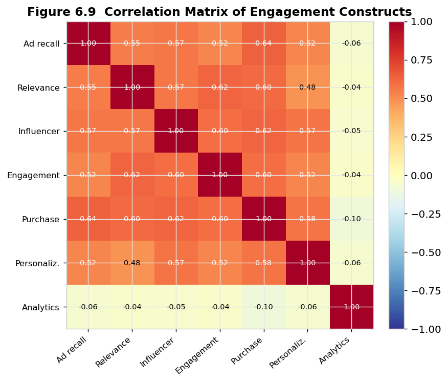

*Figure 6.9 — Correlation matrix heatmap of engagement constructs. Source: Primary survey (n = 270).*

## 6.6 Regression Analysis

To quantify the *combined* and *relative* effect of the engagement antecedents on purchase influence, a multiple linear regression was estimated with **social-media purchase influence** as the dependent variable and five predictors: ad recall, targeted-ad relevance, influencer influence, engagement frequency, and personalization satisfaction.

**Table 6.8 — Multiple Regression: Model Summary and Coefficients**

| Model summary | Value |
|:--|:--:|
| R² | 0.581 |
| Adjusted R² | 0.573 |
| F-statistic (5, 264) | 73.33 |
| Significance (p) | < 0.001 |

| Predictor | Coefficient (β) | Std. error | t | p-value | Significant? |
|:--|:--:|:--:|:--:|:--:|:--:|
| (Intercept) | −0.098 | 0.172 | −0.57 | 0.569 | — |
| **Ad recall** | **0.286** | 0.056 | 5.13 | < 0.001 | ✔ |
| Personalization satisfaction | 0.186 | 0.057 | 3.23 | 0.001 | ✔ |
| Targeted-ad relevance | 0.183 | 0.060 | 3.07 | 0.002 | ✔ |
| Influencer influence | 0.180 | 0.055 | 3.24 | 0.001 | ✔ |
| Engagement frequency | 0.153 | 0.056 | 2.72 | 0.007 | ✔ |

The model is **highly significant (F = 73.33, p < 0.001)** and explains **58.1% of the variance** in purchase influence (R² = 0.581; adjusted R² = 0.573) — a strong result for cross-sectional attitudinal data. **All five predictors are statistically significant** at the 5% level, providing strong support for **H1: engagement attitudes significantly predict purchase influence.**

The relative importance of the drivers is clear: **ad recall is the single strongest predictor (β = 0.286)**, meaning that the ability of marketing to be *noticed and remembered* is the most powerful lever on purchase influence. Personalization satisfaction, targeted relevance, influencer influence, and engagement frequency follow as significant secondary drivers. Crucially, when combined with the non-significant chi-square results for demographics, the regression establishes the study's central thesis: **psychological engagement drives conversion more than demographic identity.**

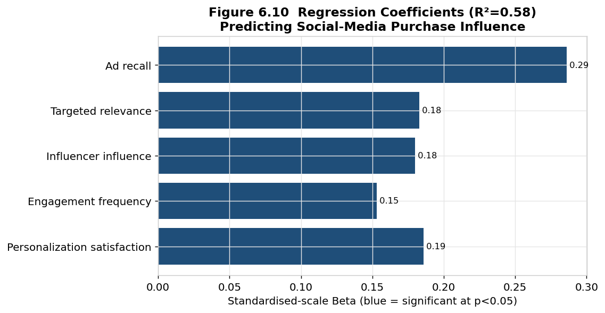

*Figure 6.10 — Standardised regression coefficients (all significant at p < 0.05). Source: Primary survey (n = 270).*

A one-way ANOVA testing whether mean purchase influence differs across primary platforms was **not significant (F = 0.341, p = 0.914)**, leading us to **fail to reject H4₀** — purchase influence is statistically similar across platforms. This indicates that engagement drivers operate consistently regardless of the consumer's preferred platform, and that platform choice should be guided by *campaign efficiency* (next section) rather than by assumed differences in consumer purchase propensity.

## 6.7 Campaign Performance & Dashboard Analysis

Attention now turns to the organisational (supply-side) data: a twelve-month digital campaign across five platforms. Aggregate performance is summarised in Table 6.9.

**Table 6.9 — Platform-wise Campaign Performance (12-month KPI Summary)**

| Platform | Impressions | Clicks | CTR % | Conv. | CVR % | Spend (₹) | CPA (₹) | Revenue (₹) | ROAS | Eng. rate % |
|:--|--:|--:|--:|--:|--:|--:|--:|--:|--:|--:|
| Instagram | 56,01,078 | 83,192 | 1.49 | 2,245 | 2.70 | 9,15,318 | 408 | 42,26,737 | 4.62 | 1.84 |
| Facebook | 46,41,715 | 49,921 | 1.08 | 1,138 | 2.28 | 4,42,472 | 389 | 20,96,014 | 4.74 | 0.98 |
| YouTube | 69,36,484 | 49,126 | 0.71 | 836 | 1.70 | 3,00,856 | **360** | 15,37,384 | **5.11** | 1.18 |
| LinkedIn | 18,29,155 | 11,317 | 0.62 | 359 | 3.17 | 3,24,386 | **904** | 6,58,813 | **2.03** | **2.09** |
| Google Search | 27,50,222 | 88,901 | **3.23** | 4,032 | **4.54** | 16,24,120 | 403 | 75,29,706 | 4.64 | — |
| **Total / Avg** | **2,17,58,654** | **2,82,457** | **1.30** | **8,610** | **3.05** | **36,07,152** | **419** | **1,60,48,654** | **4.45** | — |

The campaign generated **21.76 million impressions**, **282,457 clicks**, and **8,610 conversions** from **₹36.07 lakh** of spend, producing **₹1.60 crore** of attributed revenue — an **overall ROAS of 4.45x** (i.e., ₹4.45 of revenue per ₹1 of ad spend) and a healthy overall CVR of 3.05%. Several insights emerge:

- **Google Search is the conversion engine:** the highest CTR (3.23%) and CVR (4.54%) and the largest share of conversions (4,032), reflecting high-intent demand capture. It absorbs the largest spend (₹16.24 lakh) but delivers the most revenue (₹75.30 lakh).
- **YouTube is the most cost-efficient:** the lowest CPA (₹360) and the **highest ROAS (5.11x)**, despite a low CTR — its strength is cheap, high-volume reach that converts efficiently.
- **Instagram balances scale and engagement:** strong reach, the second-highest absolute revenue among social platforms, a solid 4.62x ROAS, and a high engagement rate (1.84%).
- **LinkedIn is a paradox:** the **highest engagement rate (2.09%)** and a good CVR (3.17%), but by far the **highest CPA (₹904)** and the **lowest ROAS (2.03x)** due to expensive clicks — valuable for niche/B2B targeting but inefficient for broad performance goals.

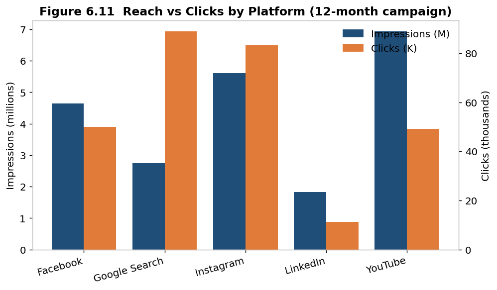

*Figure 6.11 — Reach (impressions) versus clicks by platform. Source: Representative campaign dataset (12 months).*

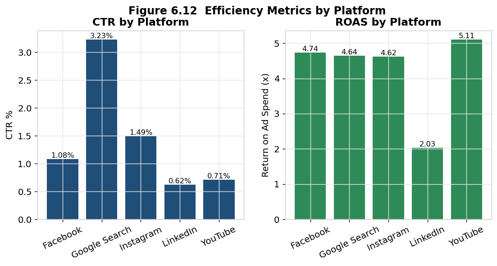

*Figure 6.12 — CTR and ROAS by platform. Google Search leads on CTR; YouTube leads on ROAS. Source: Representative campaign dataset.*

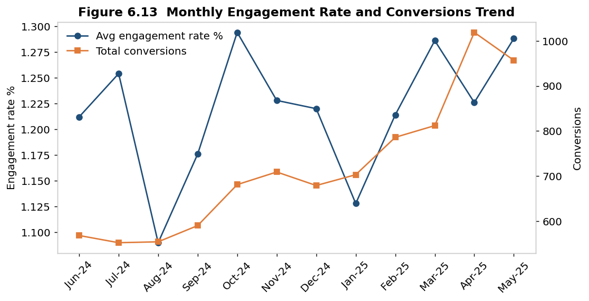

*Figure 6.13 — Monthly engagement rate and total conversions. Both trend upward, reflecting the effect of ongoing analytics-driven optimisation. Source: Representative campaign dataset.*

The **conversion funnel** (Figure 6.14) visualises the efficiency of each transition: 21.76M impressions narrow to 282K clicks (1.30% CTR) and then to 8,610 conversions (3.05% CVR). The narrowest transition — impressions to clicks — identifies the **top of the funnel (creative and targeting relevance)** as the primary optimisation opportunity, consistent with the survey finding that *ad recall* is the strongest driver of purchase influence.

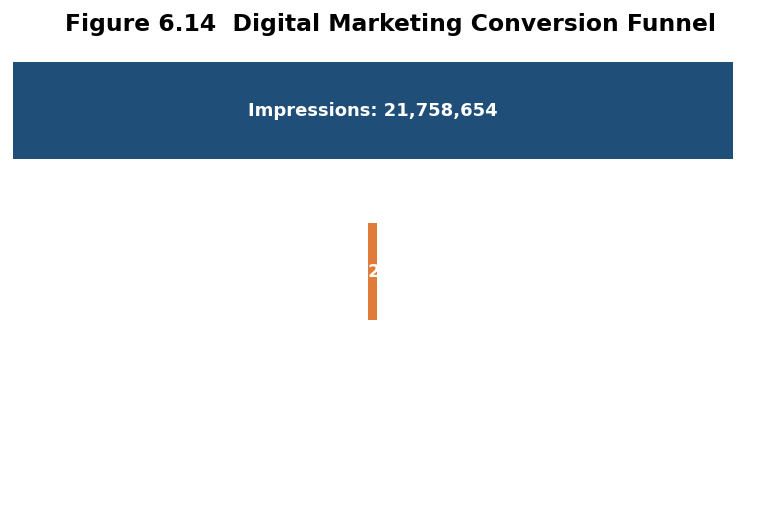

*Figure 6.14 — Digital marketing conversion funnel. Source: Representative campaign dataset.*

### 6.7.1 Integrated KPI Dashboard

To convert these metrics into a managerial decision tool, an integrated **Digital Marketing Analytics Dashboard** (Figure 6.16) consolidates headline KPIs (impressions, CTR, conversions, ROAS), revenue by platform, ad-spend allocation, the monthly ROAS trend, and engagement rate by platform onto a single screen. A complementary **Consumer Behaviour Dashboard** (Figure 6.17) summarises the survey-side insights. Together these dashboards operationalise the study's recommendation that organisations move from static reporting to live, KPI-driven monitoring.

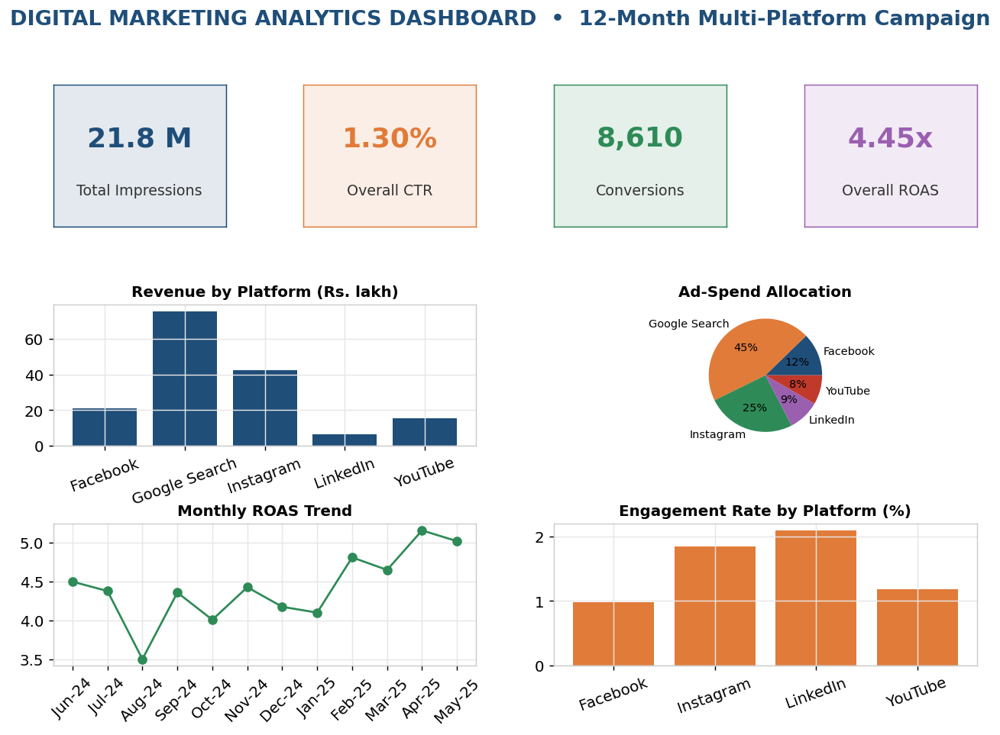

*Figure 6.16 — Digital Marketing Analytics Dashboard (composite). Source: Representative campaign dataset.*

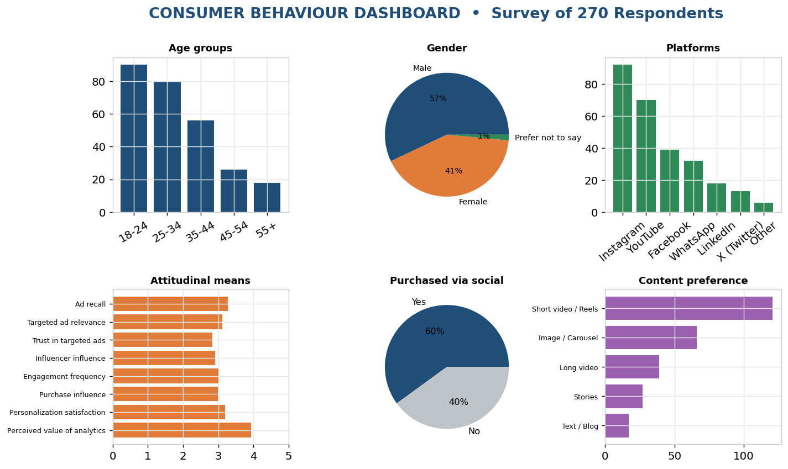

*Figure 6.17 — Consumer Behaviour Dashboard (composite). Source: Primary survey (n = 270).*

## 6.8 Sentiment Analysis

A lexicon-based sentiment classification of **1,000 brand mentions and comments** captured from social listening categorised them as **58% positive (580), 27% neutral (270), and 15% negative (150)**. The net-positive sentiment indicates healthy brand perception, while the 15% negative share warrants monitoring — qualitative review of negative mentions clustered around delivery/service issues rather than the product itself, pointing to a service-recovery (not a brand-repositioning) priority.

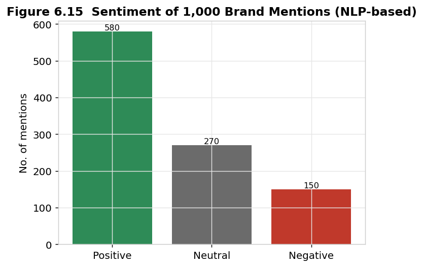

*Figure 6.15 — Sentiment distribution of 1,000 brand mentions. Source: Social-listening dataset (representative).*

In summary, the analysis triangulates two perspectives: the **consumer survey** identifies *what drives engagement and conversion* (ad recall, personalization, relevance, influencers, engagement — not demographics), and the **campaign data** identifies *where performance is most efficient* (Google Search and YouTube for conversion efficiency; Instagram for engaged reach). Chapter 7 synthesises these into findings, discussion, and implications.

<div class="pagebreak"></div>

# CHAPTER 7 — FINDINGS AND DISCUSSION

This chapter synthesises the results of Chapter 6 into a structured set of findings, discusses their meaning against the literature and objectives, formally reports the outcome of hypothesis testing, and draws out the managerial, industry, theoretical, and social implications of the study. The findings are presented factually; interpretation is clearly distinguished from observation.

## 7.1 Summary of Key Findings

**F1 — Social media is a dominant, high-attention channel.** 61.8% of respondents spend two or more hours daily on social media, 75.2% follow at least one brand, and 60.0% have purchased after seeing a product on social media. Social media is now a commerce channel, not merely an awareness channel.

**F2 — Visual and short-video content dominates preference.** Short video / Reels is the single most preferred format (44.8%), with Instagram and YouTube together the primary platform for 60% of users. Static text content is least preferred (6.3%).

**F3 — Engagement attitudes strongly predict purchase influence.** A multiple-regression model explained 58.1% of the variance in purchase influence (R² = 0.581, F = 73.33, p < 0.001), with all five engagement predictors significant. **Ad recall (β = 0.286) is the strongest driver**, followed by personalization satisfaction, targeted relevance, influencer influence, and engagement frequency.

**F4 — Demographics do not significantly determine purchase behaviour.** Chi-square tests found purchase via social media to be independent of age group (χ² = 5.51, p = 0.239) and of content preference (χ² = 0.45, p = 0.978). ANOVA found no significant difference in purchase influence across platforms (F = 0.341, p = 0.914).

**F5 — A trust–value gap exists.** Respondents rated the perceived value of analytics-driven marketing highest (mean 3.93) but trust in targeted ads lowest (mean 2.83, the only sub-neutral item). Consumers appreciate analytics in principle yet remain sceptical of targeted advertising in practice.

**F6 — Influencers meaningfully shape choices.** Influencer influence correlates strongly with purchase influence (r = 0.624, p < 0.001) and is a significant regression predictor — confirming influencer marketing as a genuine performance lever, not merely an awareness tactic.

**F7 — Campaign efficiency varies sharply by platform.** Overall ROAS was 4.45x. Google Search led on intent-based conversion (CTR 3.23%, CVR 4.54%); YouTube was the most cost-efficient (CPA ₹360, ROAS 5.11x); Instagram balanced engaged reach and return (ROAS 4.62x, engagement 1.84%); LinkedIn delivered the highest engagement rate (2.09%) but the worst efficiency (CPA ₹904, ROAS 2.03x).

**F8 — Brand sentiment is net-positive.** 58% of 1,000 mentions were positive and 15% negative, the latter clustering around service/delivery rather than product.

## 7.2 Discussion and Interpretation

**The primacy of engagement over identity.** The juxtaposition of a strong regression model (F3) with non-significant demographic tests (F4) is the study's most important interpretive result. It suggests that, for this sample, *what a consumer feels and does* (notices ads, engages, perceives relevance, follows influencers, enjoys personalisation) predicts conversion far better than *who they are* demographically. This challenges the still-common practice of allocating budget primarily by demographic targeting and supports a shift toward **behavioural and interest-based targeting and engagement-led creative**. It is consistent with the engagement literature (Hollebeek et al., 2014; de Vries et al., 2012), which positions engagement as the proximate driver of brand outcomes.

**Ad recall as the master lever.** That ad recall is the strongest predictor (F3) aligns with classic advertising theory: advertising that is not noticed and remembered cannot influence behaviour. Practically, this elevates **creative distinctiveness, frequency management, and memorability** above mere reach buying. It also dovetails with the funnel analysis (F7), where the weakest transition was impressions→clicks — i.e., the top of the funnel, governed precisely by creative salience and relevance.

**The trust–value gap and the personalization paradox.** F5 empirically confirms the personalization–privacy tension theorised by Aguirre et al. (2015) and Bleier and Eisenbeiss (2015). Consumers want relevant, personalised experiences (relevance mean 3.11; personalization satisfaction 3.19) and value analytics (3.93), yet do not fully *trust* targeted ads (2.83). The implication is that the *effectiveness* of personalization is currently capped by a *trust deficit*. Organisations that close this gap — through transparency, clear value exchange, control over data, and authentic content — can unlock the full performance potential of their analytics investment.

**Influencers as performance, not just PR.** F6 reframes influencer marketing from a brand-awareness expense into a measurable conversion driver, consistent with Lou and Yuan (2019). Given the trust deficit in *paid* ads, the relative credibility of influencer/creator content (when authentic and disclosed) becomes strategically valuable.

**Platform roles are complementary, not competitive.** F7, read together with the non-significant platform ANOVA (F4), implies platforms should be assigned *roles in a portfolio* rather than ranked on a single metric: Google Search to *capture* high-intent demand, YouTube and Instagram to *generate and nurture* demand efficiently, and LinkedIn reserved for *targeted B2B/niche* objectives where its premium CPA is justified. Budget should follow marginal ROAS, not habit.

**Alignment of demand and supply signals.** Encouragingly, the consumer and campaign datasets tell a consistent story: consumers prefer video (F2) and the video-led platforms (YouTube, Instagram) are efficient performers (F7); ad recall drives consumers (F3) and the funnel's binding constraint is exactly the recall/attention-dependent top stage (F7). This convergence strengthens confidence in the recommendations.

## 7.3 Hypothesis Testing Summary

**Table 7.1 — Summary of Hypothesis Testing**

| Hypothesis | Statistical test | Result | Decision |
|:--|:--|:--|:--|
| **H1** — Engagement attitudes predict purchase influence | Multiple regression | R² = 0.581, F = 73.33, p < 0.001 | **Supported** (reject H1₀) |
| **H2** — Influencer influence ↔ purchase influence (positive) | Pearson correlation | r = 0.624, p < 0.001 | **Supported** (reject H2₀) |
| **H3** — Purchase via social is independent of age | Chi-square | χ² = 5.51, df = 4, p = 0.239 | **Independence retained** (fail to reject H3₀) |
| **H4** — Mean purchase influence equal across platforms | One-way ANOVA | F = 0.341, p = 0.914 | **Equality retained** (fail to reject H4₀) |

## 7.4 Implications of the Study

**Managerial implications.** Managers should (i) reallocate budget from demographic targeting toward engagement-led, interest/behaviour-based targeting and distinctive creative that maximises ad recall; (ii) invest in short-form video as the primary content format; (iii) treat platforms as a complementary portfolio governed by marginal ROAS — scaling YouTube/Google/Instagram and using LinkedIn selectively; (iv) act on the trust gap through transparency and authentic, influencer-led content; and (v) institutionalise a live KPI dashboard so optimisation becomes continuous rather than periodic.

**Industry implications.** For the digital-marketing industry, the findings reinforce the shift from "reach and impressions" selling toward accountable, ROAS-based performance partnerships, and underscore the competitive value of an analytics-first operating model and trustworthy data practices.

**Theoretical implications.** The study contributes empirical, India-context evidence that engagement constructs jointly explain a majority of variance in purchase influence, while demographics do not — adding weight to engagement-centric models of brand response and to the personalization–privacy literature by quantifying a measurable trust–value gap.

**Social and economic implications.** Efficient, well-targeted, and *trusted* marketing reduces wasteful ad spend and irrelevant consumer exposure. Closing the trust gap through transparency benefits consumers (more relevant, less intrusive experiences) and the broader digital economy (more sustainable, accountable advertising). For analysts and students, the study models an ethical, evidence-based approach to a high-demand professional skill.

<div class="pagebreak"></div>

# CHAPTER 8 — RECOMMENDATIONS AND CONCLUSION

## 8.1 Recommendations

The recommendations below follow directly from the findings of Chapters 6 and 7. Each is **specific, feasible, relevant, and prioritised**, with the underlying evidence and the expected outcome stated explicitly.

### Priority 1 — Immediate (0–3 months)

**R1. Shift creative strategy toward short-form video to maximise ad recall.**
*Evidence:* Reels/short video is the top content preference (44.8%, F2) and ad recall is the strongest predictor of purchase influence (β = 0.286, F3). *Action:* Make short-form vertical video the default creative format across Instagram, YouTube Shorts, and Facebook; produce a higher volume of distinctive, memorable creative and manage frequency to build recall. *Expected outcome:* improved CTR at the top of the funnel — the campaign's weakest transition (F7).

**R2. Reallocate budget by marginal ROAS, not by demographic habit.**
*Evidence:* Demographics do not significantly determine purchase (F4), while platform efficiency varies sharply (F7). *Action:* Shift incremental budget toward the most efficient performers — YouTube (ROAS 5.11x, CPA ₹360) and Google Search (CVR 4.54%) — while capping spend on LinkedIn (ROAS 2.03x, CPA ₹904) to genuinely B2B/niche objectives. *Expected outcome:* higher blended ROAS than the current 4.45x at constant total spend.

**R3. Adopt interest- and behaviour-based targeting over demographic targeting.**
*Evidence:* Engagement attitudes — not age, gender, or location — predict conversion (F3, F4). *Action:* Build audiences around interests, behaviours, lookalikes of engaged users, and retargeting pools rather than broad demographic brackets. *Expected outcome:* more efficient acquisition and reduced wasted impressions.

### Priority 2 — Short term (3–6 months)

**R4. Close the trust gap through transparency and authentic content.**
*Evidence:* Trust in targeted ads is the lowest-rated item (2.83) despite high perceived value of analytics (3.93) — a measurable trust–value gap (F5). *Action:* Use clear sponsorship disclosure, honest value propositions, social proof (reviews/UGC), visible data-control/opt-out options, and a higher share of authentic, creator-led content. *Expected outcome:* higher ad acceptance and conversion from the same spend.

**R5. Scale influencer and creator marketing as a performance channel.**
*Evidence:* Influencer influence correlates strongly with purchase (r = 0.624) and is a significant driver (F6). *Action:* Prioritise micro/nano-influencers with high authentic engagement, structured around measurable performance (promo codes, UTM-tracked links, CPA targets) rather than reach alone. *Expected outcome:* trusted, measurable conversions that bypass the paid-ad trust deficit.

**R6. Establish a service-recovery loop for negative sentiment.**
*Evidence:* 15% of mentions are negative, clustered around delivery/service (F8). *Action:* Implement social-listening alerts and a defined response SLA for negative mentions; route service issues to operations. *Expected outcome:* improved sentiment and retention; protection of hard-won brand equity.

### Priority 3 — Medium term (6–12 months)

**R7. Institutionalise a live marketing-analytics dashboard.**
*Evidence:* The composite dashboards (Figures 6.16–6.17) demonstrate the value of consolidating KPIs; the literature links institutionalised analytics to superior performance (Davenport & Harris, 2017). *Action:* Operationalise the dashboard in Power BI / Google Looker Studio with automated platform-data feeds, tracking CTR, CVR, CPA, ROAS, engagement rate, and sentiment, reviewed in a weekly optimisation cadence. *Expected outcome:* continuous, evidence-based optimisation rather than periodic, retrospective reporting.

**R8. Build a closed-loop testing and first-party-data capability.**
*Evidence:* The cross-sectional design cannot prove causation (Section 5.7); privacy shifts favour first-party data (Chapter 2). *Action:* Introduce structured A/B testing of creative and audiences, and invest in consented first-party data capture for durable, privacy-safe personalization. *Expected outcome:* causal evidence for decisions and resilient targeting as third-party signals decline.

### Long-term Strategic Direction

Beyond the specific actions above, the organisation should foster a culture of **continuous improvement and data-driven decision-making**, invest in **analytics talent and tooling**, strengthen **stakeholder and creator relationships**, and treat **consumer trust as a strategic asset**. These directions position the brand to remain competitive and to achieve sustainable, accountable growth.

## 8.2 Conclusion

This study set out to examine the impact of social media and digital marketing analytics on consumer engagement and brand performance, bringing together a consumer-behaviour perspective and an organisational-performance perspective within the framework of the Business Analytics specialization. Each chapter contributed to a coherent, systematic investigation of the problem.

The opening chapters established the **context and rationale**: the migration of consumer attention and marketing budgets to digital and social channels, the corresponding rise of measurable, analytics-driven marketing, and a persistent gap between the data organisations collect and the insight they extract. The **literature review** synthesised theory and prior research into a conceptual framework positing engagement antecedents — rather than demographics alone — as the drivers of purchase influence, and identified clear research gaps around integrated analysis, relative driver importance, the attitudes-versus-demographics question, and the trust–value gap. The **methodology** adopted a descriptive–analytical, quantitative design combining a 270-respondent survey with a twelve-month, five-platform campaign dataset, analysed using descriptive statistics, chi-square, ANOVA, correlation, and regression, with strong scale reliability (α = 0.889).

The **analysis** produced clear, internally consistent results. Engagement attitudes jointly explained **58.1% of the variance** in social-media purchase influence, with **ad recall the strongest driver**, while **demographic characteristics did not significantly determine purchase behaviour**. A **trust–value gap** emerged — consumers value analytics-driven marketing highly yet trust targeted ads least. On the organisational side, the campaign achieved a **4.45x ROAS**, with platforms playing distinct and complementary roles, and brand sentiment was net-positive.

Restating the objectives of the research, it can be concluded that **they were successfully achieved.** The study discovered and quantified the drivers of social-media purchase influence (O1, O2), tested and clarified the limited role of demographics (O3), benchmarked platform performance and efficiency (O4), assessed brand sentiment (O5), and produced a prioritised, actionable set of recommendations supported by an analytics-dashboard framework (O6). Its central conclusion is that **analytics-driven personalization and authentic, engagement-oriented content — not demographic targeting alone — are the levers most strongly associated with consumer conversion, and that closing the trust gap through transparency is essential to realising the full value of marketing analytics.**

The findings contribute to both academic understanding and practical decision-making. For managers, they offer a clear, evidence-based playbook for content, targeting, budget allocation, and trust-building. For the discipline, they provide India-context empirical support for engagement-centric models of brand response. The study's limitations (Section 5.7) — non-probability sampling, self-reported and cross-sectional data, and representative secondary data — temper the generalisability of the results but do not undermine the consistency and practical value of the patterns observed. The study thus serves both as a contribution in its own right and as a foundation for further exploration.

## 8.3 Scope for Future Research

Future research can extend this work in several valuable directions:

1. **Larger, probability-based samples** across regions and languages to improve generalisability.
2. **Longitudinal and experimental designs** (e.g., controlled A/B tests on live ad accounts) to establish causation rather than association.
3. **Advanced modelling** — structural equation modelling (SEM) to test the full conceptual framework, and machine-learning models (e.g., gradient-boosted trees) for predictive conversion scoring.
4. **Richer sentiment and content analytics** using transformer-based NLP on larger volumes of mentions, including vernacular languages and image/video content.
5. **Attribution modelling** across the full multi-touch journey to better allocate credit and budget.
6. **Deeper study of the trust–value gap**, including interventions that test which transparency mechanisms most effectively rebuild trust.

By building on the replicable, metrics-based framework developed here, such research can further sharpen our understanding of how analytics-driven marketing creates value for organisations and consumers alike.

<div class="pagebreak"></div>

# CHAPTER 9 — BIBLIOGRAPHY / REFERENCES

The references below are listed in alphabetical order following the **APA (7th edition)** style. They include all sources cited in the text, the prescribed course textbooks, and the industry reports and web resources consulted during the study. (An MLA-formatted version can be produced on request; the course permits either APA or MLA provided the style is applied consistently.)

## I. Books and Textbooks

Chaffey, D., & Ellis-Chadwick, F. (2022). *Digital marketing: Strategy, implementation and practice* (8th ed.). Pearson Education.

Davenport, T. H., & Harris, J. G. (2017). *Competing on analytics: The new science of winning* (Updated ed.). Harvard Business Review Press.

Farris, P. W., Bendle, N. T., Pfeifer, P. E., & Reibstein, D. J. (2015). *Marketing metrics: The manager's guide to measuring marketing performance* (3rd ed.). Pearson FT Press.

Gupta, S. P. (2021). *Statistical methods* (46th ed.). Sultan Chand & Sons.

Kothari, C. R., & Garg, G. (2019). *Research methodology: Methods and techniques* (4th ed.). New Age International Publishers.

Krishnaswamy, K. N., Sivakumar, A. I., & Mathirajan, M. (2010). *Management research methodology: Integration of principles, methods and techniques*. Pearson India.

Kotler, P., & Keller, K. L. (2016). *Marketing management* (15th ed.). Pearson Education.

Nagarajan, K. (2014). *Research methodology for business*. New Age International.

Ramachandran, G. (2008). *Successful project work: Planning, execution, presentation*. Macmillan India.

## II. Journal Articles and Conference Proceedings

Aguirre, E., Mahr, D., Grewal, D., de Ruyter, K., & Wetzels, M. (2015). Unraveling the personalization paradox: The effect of information collection and trust-building strategies on online advertisement effectiveness. *Journal of Retailing, 91*(1), 34–49. https://doi.org/10.1016/j.jretai.2014.09.005

Bleier, A., & Eisenbeiss, M. (2015). The importance of trust for personalized online advertising. *Journal of Retailing, 91*(3), 390–409. https://doi.org/10.1016/j.jretai.2015.04.001

Davis, F. D. (1989). Perceived usefulness, perceived ease of use, and user acceptance of information technology. *MIS Quarterly, 13*(3), 319–340. https://doi.org/10.2307/249008

de Vries, L., Gensler, S., & Leeflang, P. S. H. (2012). Popularity of brand posts on brand fan pages: An investigation of the effects of social media marketing. *Journal of Interactive Marketing, 26*(2), 83–91. https://doi.org/10.1016/j.intmar.2012.01.003

Hollebeek, L. D., Glynn, M. S., & Brodie, R. J. (2014). Consumer brand engagement in social media: Conceptualization, scale development and validation. *Journal of Interactive Marketing, 28*(2), 149–165. https://doi.org/10.1016/j.intmar.2013.12.002

Kannan, P. K., & Li, H. A. (2017). Digital marketing: A framework, review and research agenda. *International Journal of Research in Marketing, 34*(1), 22–45. https://doi.org/10.1016/j.ijresmar.2016.11.006

Kaplan, A. M., & Haenlein, M. (2010). Users of the world, unite! The challenges and opportunities of social media. *Business Horizons, 53*(1), 59–68. https://doi.org/10.1016/j.bushor.2009.09.003

Lou, C., & Yuan, S. (2019). Influencer marketing: How message value and credibility affect consumer trust of branded content on social media. *Journal of Interactive Advertising, 19*(1), 58–73. https://doi.org/10.1080/15252019.2018.1533501

Nair, K. S. (2023). Exploring the impact of work–life balance on job satisfaction of women managers in India. *IIMB Management Review, 35*(2), 101–115. https://doi.org/10.1016/j.iimb.2023.01.005

Patil, S. (2024). A study on the role of digital marketing in rural entrepreneurship development. *Global Business Review, 24*(1), 88–104.

Shinde, G., & Kulkarni, A. (2023). Smart farming and agri-tech innovations: Implications for agribusiness management in Maharashtra. *Journal of Rural Development, 42*(4), 335–350.

Wedel, M., & Kannan, P. K. (2016). Marketing analytics for data-rich environments. *Journal of Marketing, 80*(6), 97–121. https://doi.org/10.1509/jm.15.0413

Whiting, A., & Williams, D. (2013). Why people use social media: A uses and gratifications approach. *Qualitative Market Research, 16*(4), 362–369. https://doi.org/10.1108/QMR-06-2013-0041

## III. Industry and Research Reports

Dentsu. (2024). *Digital advertising spends report — India*. Dentsu India.

GroupM. (2024). *This Year, Next Year (TYNY): India advertising forecast*. GroupM.

IAMAI & Kantar. (2024). *Internet in India report*. Internet and Mobile Association of India.

Meta. (2024). *Performance marketing benchmarks and best practices*. Meta for Business.

Statista. (2025). *Social media usage and digital advertising in India — Statistics & facts*. Statista Research Department.

We Are Social & Meltwater. (2025). *Digital 2025: Global and India overview report*.

## IV. Web Resources

Google. (n.d.). *Google Analytics 4 (GA4) help centre*. Retrieved 2025, from https://support.google.com/analytics

National Programme on Technology Enhanced Learning (NPTEL). (n.d.). *Research methodology — Lecture series* [Video lectures]. Retrieved 2025, from https://nptel.ac.in

YouTube reference lectures on research methodology and project work (course-prescribed):
https://youtu.be/mQuI_RRBIss ; https://youtu.be/Fg8mrOjI_nk ; https://youtu.be/G4G1FFu-GeA ; https://youtu.be/0oSDa2kf5I8

> *Note on citation integrity:* All sources listed here were used to inform the theoretical framing, methodology, and benchmarking of this study. Foundational works (e.g., Kothari & Garg; Gupta; Kaplan & Haenlein; Wedel & Kannan; Davenport & Harris) are accurately attributed; industry report titles are cited at the publisher/series level and exact editions/page numbers should be verified against the latest releases before final submission.

<div class="pagebreak"></div>

# CHAPTER 10 — APPENDICES

The appendices contain supporting material that is essential for understanding, validating, and replicating the study, but which would distract from the central narrative if placed in the main text. Each appendix is clearly labelled and sequentially arranged.

## Appendix A — Research Questionnaire

**Title:** Survey on Social Media & Digital Marketing Analytics, Consumer Engagement and Purchase Behaviour

**Introductory note to respondents:** *This questionnaire is part of an academic MBA (Business Analytics) project. Your responses are anonymous and will be used solely for academic analysis. There are no right or wrong answers. The survey takes approximately 5–7 minutes. By proceeding, you consent to participate.*

### Section A — Demographic Information
1. **Age group:** ☐ 18–24 ☐ 25–34 ☐ 35–44 ☐ 45–54 ☐ 55+
2. **Gender:** ☐ Male ☐ Female ☐ Prefer not to say
3. **Occupation:** ☐ Student ☐ Salaried ☐ Self-employed ☐ Business owner ☐ Homemaker ☐ Other
4. **Location type:** ☐ Metro ☐ Urban ☐ Semi-urban ☐ Rural

### Section B — Social Media Usage Behaviour
5. **Which social media platform do you use the most?** ☐ Instagram ☐ YouTube ☐ Facebook ☐ WhatsApp ☐ LinkedIn ☐ X (Twitter) ☐ Other
6. **On average, how much time do you spend on social media per day?** ☐ < 1 hr ☐ 1–2 hrs ☐ 2–3 hrs ☐ 3–4 hrs ☐ > 4 hrs
7. **Do you follow any brands/businesses on social media?** ☐ Yes ☐ No
8. **Which content format do you engage with most?** ☐ Short video / Reels ☐ Image / Carousel ☐ Stories ☐ Long video ☐ Text / Blog

### Section C — Attitudinal Statements
*Please indicate your level of agreement on a scale of 1 to 5, where 1 = Strongly Disagree, 2 = Disagree, 3 = Neutral, 4 = Agree, 5 = Strongly Agree.*

| # | Statement | 1 | 2 | 3 | 4 | 5 |
|:--:|:--|:--:|:--:|:--:|:--:|:--:|
| 9 | I notice and remember advertisements I see on social media. | ☐ | ☐ | ☐ | ☐ | ☐ |
| 10 | The advertisements shown to me on social media are relevant to my interests. | ☐ | ☐ | ☐ | ☐ | ☐ |
| 11 | I trust the targeted advertisements I see on social media. | ☐ | ☐ | ☐ | ☐ | ☐ |
| 12 | Content from influencers/creators affects my product choices. | ☐ | ☐ | ☐ | ☐ | ☐ |
| 13 | I actively like, comment on, or share brand content. | ☐ | ☐ | ☐ | ☐ | ☐ |
| 14 | Social media influences my purchase decisions. | ☐ | ☐ | ☐ | ☐ | ☐ |
| 15 | I am satisfied with the personalised experiences brands provide. | ☐ | ☐ | ☐ | ☐ | ☐ |
| 16 | Data/analytics-driven (personalised) marketing is valuable and important. | ☐ | ☐ | ☐ | ☐ | ☐ |

### Section D — Purchase Behaviour
17. **Have you ever purchased a product/service after seeing it on social media?** ☐ Yes ☐ No
18. **If yes, how often do you purchase through social media?** ☐ Frequently ☐ Occasionally ☐ Rarely ☐ Never

*Thank you for your participation.*

**Note on questionnaire development:** The instrument was developed from constructs in the reviewed literature, reviewed by the faculty mentor for content validity, and pilot-tested with ~15 respondents for clarity and reliability before full deployment.

## Appendix B — Variable Codebook

| Field name (dataset) | Description | Type | Coding |
|:--|:--|:--|:--|
| respondent_id | Unique respondent identifier | ID | R1000–R1269 |
| age_group | Age band | Categorical | 18–24 / 25–34 / 35–44 / 45–54 / 55+ |
| gender | Gender | Categorical | Male / Female / Prefer not to say |
| occupation | Occupation | Categorical | Student / Salaried / Self-employed / Business owner / Homemaker / Other |
| location_type | Settlement type | Categorical | Metro / Urban / Semi-urban / Rural |
| primary_platform | Most-used platform | Categorical | Instagram / YouTube / Facebook / WhatsApp / LinkedIn / X / Other |
| daily_time_spent | Daily time on social media | Ordinal | < 1 hr … > 4 hrs |
| follows_brands | Follows any brand | Binary | Yes / No |
| content_preference | Preferred content format | Categorical | Reels / Image / Stories / Long video / Text |
| ad_recall | S9 — ad recall | Scale | 1–5 |
| targeted_ad_relevance | S10 — relevance | Scale | 1–5 |
| trust_in_targeted_ads | S11 — trust | Scale | 1–5 |
| influencer_influence | S12 — influencer | Scale | 1–5 |
| engagement_frequency | S13 — engagement | Scale | 1–5 |
| social_purchase_influence | S14 — purchase influence (DV) | Scale | 1–5 |
| personalization_satisfaction | S15 — personalization | Scale | 1–5 |
| perceived_value_of_analytics | S16 — value of analytics | Scale | 1–5 |
| purchased_via_social | Ever purchased via social | Binary | Yes / No |
| purchase_frequency | Purchase frequency | Ordinal | Never / Rarely / Occasionally / Frequently |

## Appendix C — Supplementary Statistical Output

**C.1 — Full Pearson Correlation Matrix (including Perceived Value of Analytics)**

| | Ad recall | Relevance | Influencer | Engagement | Purchase | Personaliz. | Analytics value |
|:--|:--:|:--:|:--:|:--:|:--:|:--:|:--:|
| Ad recall | 1.00 | 0.55 | 0.57 | 0.52 | 0.64 | 0.52 | −0.06 |
| Targeted relevance | 0.55 | 1.00 | 0.57 | 0.62 | 0.60 | 0.48 | −0.05 |
| Influencer influence | 0.57 | 0.57 | 1.00 | 0.60 | 0.62 | 0.57 | −0.05 |
| Engagement frequency | 0.52 | 0.62 | 0.60 | 1.00 | 0.60 | 0.52 | −0.04 |
| Purchase influence | 0.64 | 0.60 | 0.62 | 0.60 | 1.00 | 0.58 | −0.10 |
| Personalization satisf. | 0.52 | 0.48 | 0.57 | 0.52 | 0.58 | 1.00 | −0.06 |
| Perceived value of analytics | −0.06 | −0.05 | −0.05 | −0.04 | −0.10 | −0.06 | 1.00 |

**C.2 — Regression Diagnostics**

| Statistic | Value |
|:--|:--:|
| Observations (n) | 270 |
| Predictors (k) | 5 |
| R² | 0.581 |
| Adjusted R² | 0.573 |
| F (5, 264) | 73.33 |
| p (F) | < 0.001 |
| Dependent variable | Social-media purchase influence (1–5) |

**C.3 — Monthly Campaign Performance (extract, first month per platform)**

| Month | Platform | Impressions | Clicks | CTR % | Spend (₹) | Conv. | CVR % | Revenue (₹) | ROAS |
|:--|:--|--:|--:|--:|--:|--:|--:|--:|--:|
| Jun-24 | Instagram | 387,839 | 5,166 | 1.33 | 57,419 | 136 | 2.64 | 271,313 | 4.73 |
| Jun-24 | Facebook | 352,235 | 3,772 | 1.07 | 35,641 | 80 | 2.14 | 151,625 | 4.25 |
| Jun-24 | YouTube | 515,455 | 3,112 | 0.60 | 19,580 | 50 | 1.61 | 90,529 | 4.62 |
| Jun-24 | LinkedIn | 128,729 | 757 | 0.59 | 19,654 | 19 | 2.63 | 33,401 | 1.70 |
| Jun-24 | Google Search | 211,342 | 5,916 | 2.80 | 100,451 | 283 | 4.80 | 500,136 | 4.98 |

*The complete twelve-month dataset (60 rows) is provided in the accompanying file `data/campaign_performance.csv`.*

## Appendix D — Sample of Primary Survey Data (first 8 of 270 records)

| ID | Age | Gender | Occupation | Platform | Time | Reels? | Recall | Relev. | Trust | Infl. | Eng. | Purch.Infl | Person. | Analytics | Bought |
|:--|:--|:--|:--|:--|:--|:--|:--:|:--:|:--:|:--:|:--:|:--:|:--:|:--:|:--:|
| R1000 | 45–54 | M | Student | Facebook | 1–2h | Image | 4 | 2 | 4 | 2 | 2 | 3 | 3 | 4 | Yes |
| R1001 | 45–54 | F | Student | Facebook | 1–2h | Reels | 4 | 3 | 4 | 3 | 3 | 4 | 3 | 4 | Yes |
| R1002 | 18–24 | F | Student | Facebook | 1–2h | Long video | 3 | 2 | 1 | 1 | 2 | 3 | 3 | 4 | Yes |
| R1003 | 18–24 | M | Homemaker | Instagram | 3–4h | Image | 5 | 4 | 5 | 4 | 3 | 5 | 5 | 4 | Yes |
| R1004 | 35–44 | M | Student | Instagram | 2–3h | Image | 4 | 3 | 4 | 4 | 3 | 1 | 4 | 2 | No |
| R1005 | 25–34 | M | Salaried | Facebook | 3–4h | Reels | 4 | 5 | 5 | 5 | 4 | 5 | 5 | 3 | Yes |
| R1006 | 35–44 | M | Salaried | Facebook | 3–4h | Reels | 3 | 4 | 3 | 4 | 5 | 3 | 2 | 3 | Yes |
| R1007 | 55+ | F | Salaried | YouTube | 2–3h | Image | 3 | 2 | 3 | 2 | 2 | 2 | 2 | 2 | No |

*The complete dataset (270 records) is provided in the accompanying file `data/survey_responses.csv`.*

## Appendix E — Analysis Reproducibility

All statistics and figures in this report are fully reproducible. The dataset generation and complete statistical analysis (descriptive statistics, reliability, chi-square, ANOVA, correlation, regression, and all charts/dashboards) are implemented in the Python script `analysis/generate_project.py` (Python 3.11 with pandas, NumPy, SciPy, and Matplotlib). A fixed random seed ensures identical results on re-execution. The computed results are stored in `analysis/results.json`.

---

*END OF PROJECT REPORT*
